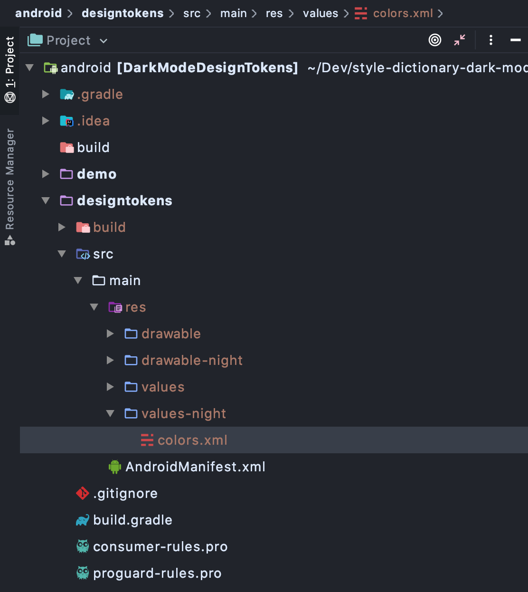
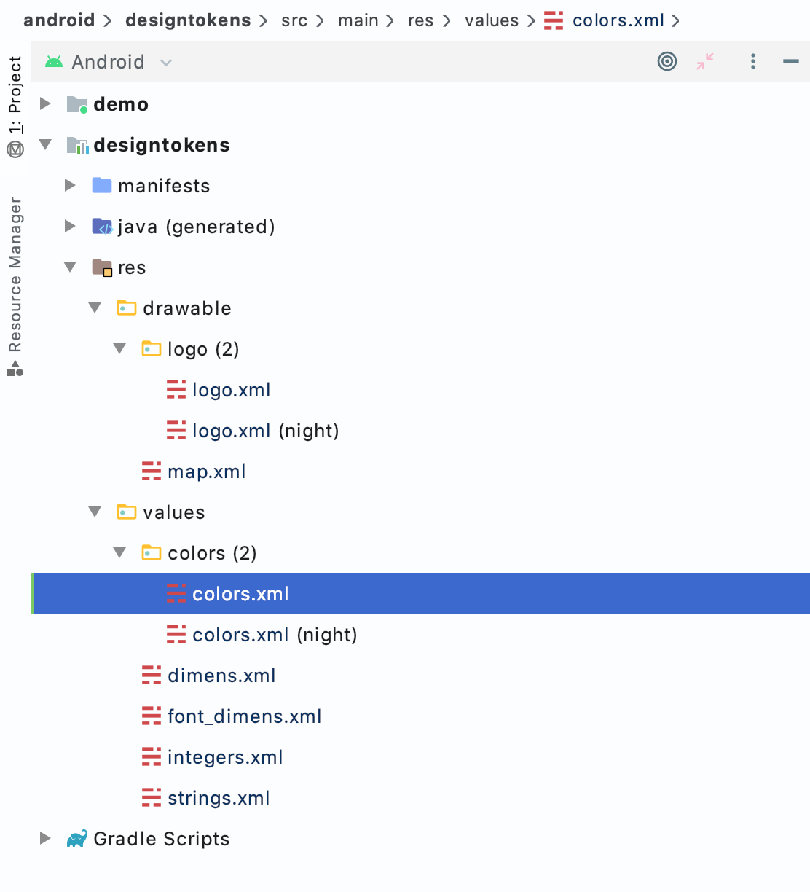
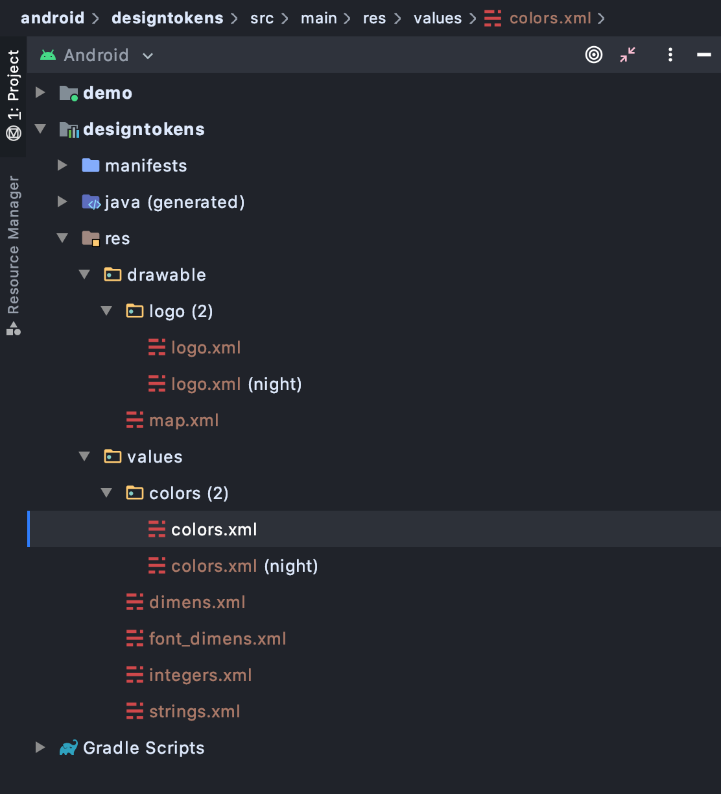
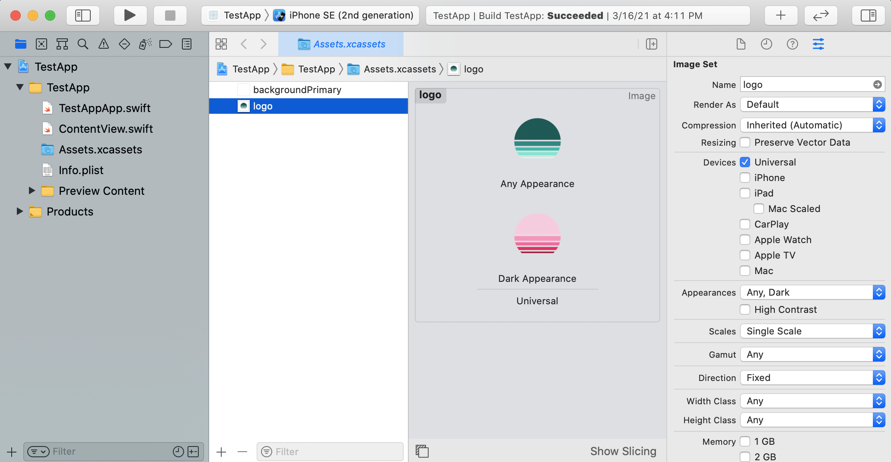
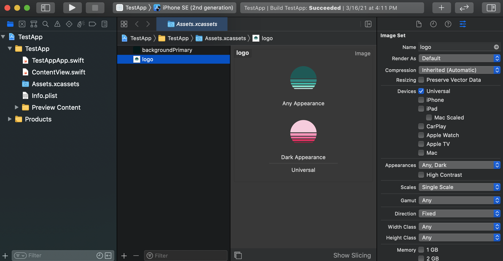
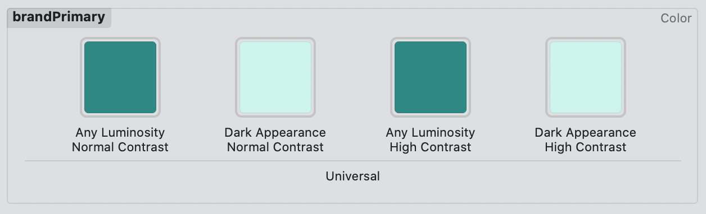
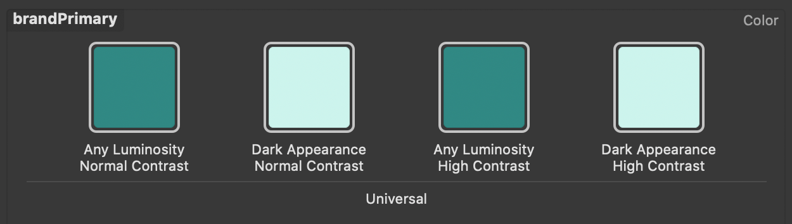
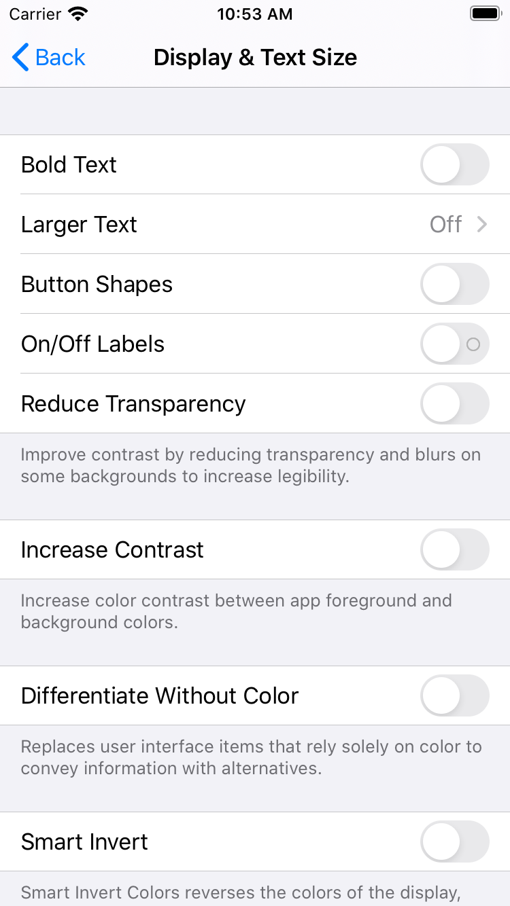
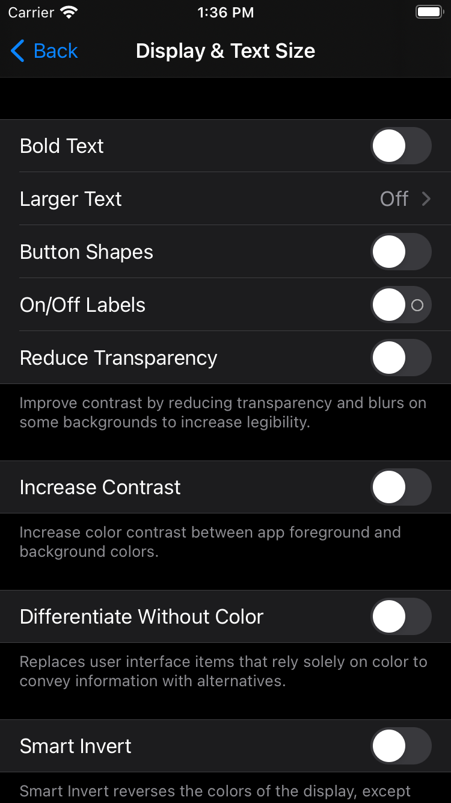

import { DiAndroid, DiApple, DiCss3 } from "react-icons/di";
import { RiStackLine, RiPencilRuler2Line, RiFileCopy2Line, RiFileCodeLine, RiGitPullRequestLine, RiGithubFill, RiContrastLine } from "react-icons/ri";
import ThemedImage from "$components/ThemedImage";
import FileTree from "$components/FileTree";
import TokenStructure from "./TokenStructure";
import "./dark-mode-styles.css";

<!-- Link shortcuts -->
[style dictionary]: https://amzn.github.io/style-dictionary
[repo]: https://github.com/dbanksdesign/style-dictionary-dark-mode
[single-token]: https://github.com/dbanksdesign/style-dictionary-dark-mode/tree/single-token
[single-token-pr]: https://github.com/dbanksdesign/style-dictionary-dark-mode/pull/4/files
[multi-file]: https://github.com/dbanksdesign/style-dictionary-dark-mode/tree/multi-file
[multi-file-pr]: https://github.com/dbanksdesign/style-dictionary-dark-mode/pull/3/files
[multi-brand]: https://github.com/amzn/style-dictionary/tree/main/examples/advanced/multi-brand-multi-platform


## Introduction

This article assumes you have a basic understanding of design tokens and [Style Dictionary][style dictionary]. Even if you don't, the first sections about how dark mode works on different platforms might be useful to you. Here is a resource with lots of articles and content if you'd like to get started with design tokens or Style Dictionary: [Awesome Design Tokens by Stu Robson](https://github.com/sturobson/Awesome-Design-Tokens)

<figure>
  <video loop={true} muted={true} autoplay={true} controls={true} playsinline={true}>
    <source src="images/preview.mp4" type="video/mp4" />
  </video>
  <figcaption>What we are going to build</figcaption>
</figure>

Let me start by saying: **supporting light and dark mode in an application or design system is HARD,** especially if your app is on multiple platforms and even more so if you have a large application. Light and dark mode on a personal site (like this one) is a whole different set of challenges. One more warning before moving on: 

> Doing dark mode poorly is *worse* than not doing dark mode at all.
> <cite>myself, from personal experience</cite>

Certain pages or worse, certain components on a page, in light mode and others in dark mode is painful to look at. Even if you don't have that issue, making sure color contrast ratios meet accessibility standards and the visual hierarchies remain in both modes is a lot of work.

Having said all that, using [design tokens](https://designtokens.org) can drastically simplify the creation and maintenance of color modes across platforms. I love that design tokens can integrate into any platform in a standard way by generating source code artifacts so that developers on a given platform don't even necessarily have to know they interact with design tokens. My approach to design token integration is to, as closely as possible, integrate with the built-in mechanisms in each platform to handle color modes rather than outputting some proprietary code. Building with design tokens on a given platform should feel natural.

We are going to build a design token package using [Style Dictionary][style dictionary] that has support for light and dark mode for color tokens and graphic assets (using tokens as well). It has demo apps in Android, iOS, and Web to show how it would integrate into those platforms. This article will serve as a high-level explanation of concepts, the why and how things work. The [Github repository][repo] has everything fully implemented with comments and more in-depth explanations. 

This article and sample will not cover:
* **How to think about and build dark mode support from a UX perspective (like creating a setting page or control for toggling light/dark mode)**
* Non-platform or framework-specific ways of implementing light/dark mode. For example, using a `<ThemeProvider>` in React or using a CSS-in-JS framework. You can still use those things if you want. I chose not to include every possible integration and instead stick to the native web, Android, and iOS mechanisms for light/dark mode.
* React Native, Flutter, Android Jetpack Compose, Nativescript, and other cross-platform libraries because this article is already probably too long. But maybe I will cover those in a future article. 
* A "complete" design token package or design system. We will only focus on color tokens and graphic assets as design tokens. I only built two components: button and badge, with limited options, just to illustrate how the color tokens work at a component level. 

I have found two different methods for implementing dark mode: single-token and multi-file. Both methods have their pros and cons, so you can decide what works best for you. If you want to skip all the explanation and go straight into the code, here is the repository: [dbanksdesign/style-dictionary-dark-mode][repo]. The repository has three branches: 

* [**main**][repo]: the project before any dark mode stuff
* [**multi-file**](https://github.com/dbanksdesign/style-dictionary-dark-mode/tree/multi-file): the implementation using the multi-file method with file extensions. [pull request view][multi-file-pr]
* [**single-token**](https://github.com/dbanksdesign/style-dictionary-dark-mode/tree/single-token): the implementation using the single-token method [pull request view][single-token-pr]

Before we start, let's look at how different platforms handle color modes. If you don't care about this stuff and want to jump into the setup, you can skip these sections.


----


## Web<DiCss3 />

The built-in way to support color modes on the web is to use the [`prefers-color-scheme` CSS media query](https://developer.mozilla.org/en-US/docs/Web/CSS/@media/prefers-color-scheme). The available options for this query are `light`, `dark`, and `no-preference`.

```css
@media (prefers-color-scheme: dark) {
  /* Dark mode styles here */
}

@media (prefers-color-scheme: light) {
  /* Light mode styles here */
}
```

You can conditionally load CSS files based on media query:

```html
<!-- No media query, will always be loaded -->
<link rel="stylesheet" href="/base.css" />
<!-- Will only be loaded if user prefers light color scheme or has no preference -->
<link rel="stylesheet" href="/light.css" media="(prefers-color-scheme: light) or (prefers-color-scheme: no-preference)" />
<!-- Will only be loaded if the user prefers a dark color scheme -->
<link rel="stylesheet" href="/dark.css" media="(prefers-color-scheme: dark)" />
```

You can use the media query to show different images:

```html
<picture>
  <!-- Use this image if the user's OS setting is light or unset -->
  <source srcset="photo-light.png" media="(prefers-color-scheme: light) or (prefers-color-scheme: no-preference)">
  <!-- Use this image if the user's OS setting is dark -->
  <source srcset="photo-dark.png" media="(prefers-color-scheme: dark)">
  
</picture>
```

You can use the media query in Javascript too:

```javascript
if (window.matchMedia && window.matchMedia(`(prefers-color-scheme: dark)`).matches) {
  // dark mode
} else {
  // light mode
}

// You can add an event listener to do something when the media query changes
// because a user changed their preference
var darkQuery = window.matchMedia('(prefers-color-scheme: dark)');
darkQuery.addListener(function(e) {
  var newTheme = e.matches ? 'dark' : 'light';
  // do something here
});
```

You could write completely separate styles for light and dark mode for each component, but that sounds a bit tedious and error-prone. Depending on your browser support requirements, you could use [CSS custom properties](https://developer.mozilla.org/en-US/docs/Web/CSS/Using_CSS_custom_properties) (sometimes called CSS variables) in addition to the `prefers-color-scheme` media query:

```css
:root {
  --color-background-primary: #fff;
  --color-font-primary: #000;
}

.card {
  background-color: var(--color-background-primary);
  color: var(--color-font-primary);
}

@media (prefers-color-scheme: dark) {
  :root {
    --color-background-primary: #000;
    --color-font-primary: #fff;
  }
}
```

Using CSS custom properties and having a layer of semantic tokens allows you to not have to re-style every component for light and dark mode. The above example is small, but can be expanded to a fit the needs of whole design systems. Also if you are using inline SVG (as opposed to using SVG in an `` tag), your SVG can be styled with CSS and also use CSS custom properties! One more quick tip before we move on: you can use the `currentColor` property in SVG and have the graphic inherit its color from its parent. This is useful if you have an icon inside a link or button, for example.

```xml{3,5}
<svg xmlns="http://www.w3.org/2000/svg" height="24" viewBox="0 0 24 24" width="24">
  <path d="M1 21h22L12 2 1 21zm12-3h-2v-2h2v2zm0-4h-2v-4h2v4z"
    fill="var(--color-font-primary)"/>
  <path d="M1 21h22L12 2 1 21zm12-3h-2v-2h2v2zm0-4h-2v-4h2v4z"
    fill="currentColor"/>
</svg>
```

See [this MDN article](https://developer.mozilla.org/en-US/docs/Web/CSS/@media/prefers-color-scheme) for more information about the `prefers-color-scheme` media query

To support dark mode in Style Dictionary we will create light and dark CSS files with CSS custom properties as well as light and dark SVG graphics. Then we will use media queries to toggle the CSS and SVG files.


----


## Android<DiAndroid />

*Note: [Android Jetpack Compose](https://developer.android.com/jetpack/compose) is a new (as of this writing) way to build interfaces in Android that doesn't use resource XML files. I chose to omit Jetpack Compose for brevity, but you can look at some discussion on this [Style Dictionary issue](https://github.com/amzn/style-dictionary/issues/478) and [this Gist](https://gist.github.com/bherbst/1b8c9a66953f25044631db68dd773429) about it if you are keen.*

Design token integration in Android works well because the Android platform has a concept of [resources](https://developer.android.com/guide/topics/resources/providing-resources), which are very much like design tokens in XML form. Maybe a more apt comparison is Android resources are more like CSS in XML form. You can define resource values, which are similar to a design token or CSS custom property, but you can also define styles and themes which are collections of resources and applied styling. You can also build components, layouts, and pages in resource XML too. 

```xml
<?xml version="1.0" encoding="utf-8"?>
<resources>
  <color name="colorRed">#ff0000</color>
  <!-- You can reference other color resources 👇 -->
  <color name="colorPrimary">@color/colorRed</color>
</resources>
```

Let's focus on how Android handles light and dark mode with resources. In an Android project, a library or application, the folder structure matters for things like resources. Android resources are XML files with a specific folder structure. There are different types of resources like values, styles, layouts, and drawables. We will focus on values and drawables (vector graphics and images). Android resource values are very similar to design tokens or CSS custom properties: they have a name, a value, and a type like `color` or `dimen` (short for dimension). 

Android uses the names of resource folders to decide when to apply specific resources in certain contexts, like light/dark mode, screen size, locale, OS version, layout direction, and device orientation, just to name a few. This is called resource *qualifiers.* Qualifiers override resources depending on the application’s context, for example, light or dark mode. You can also use qualifiers to specify different layouts and resources for certain device sizes, locales, screen densities, and more. Android calls light and dark mode, *notnight* and *night*, respectively. Without any qualifier, the resources apply to both night and notnight mode. 

<FileTree items={[{
  name: 'res',
  type: 'folder',
  items: [{
    name: 'values',
    type: 'folder',
    items: [{
      name: 'colors.xml',
      type: 'code'
    }]
  },{
    name: 'values-night',
    type: 'folder',
    items: [{
      name: 'colors.xml',
      type: 'code'
    }]
  }]
}]} />

*Note: the types of value resources in a color mode qualified resource directory are restricted to colors. A `values-night/colors.xml` file with non-colors will throw an error when trying to build.*

If you are working in Android Studio, there are different file explorer views in the side panel. In project view you can see the actual file structure. With the Android view it groups qualified and unqualified resource files:

<ThemedImage style={{width: '48%', float: 'left'}}>




</ThemedImage>

<ThemedImage style={{width: '48%', float: 'right'}}>




</ThemedImage>

<div style={{clear: 'both'}} />

### Graphics in Android

Android has support for vector graphics with its [Android Vector Drawable](https://developer.android.com/guide/topics/graphics/vector-drawable-resources) resource that shares a lot with SVG. Here is an example of Android Vector graphics format and SVG:

```xml
<vector xmlns:android="http://schemas.android.com/apk/res/android"
  android:width="128dp"
  android:height="128dp"
  android:viewportWidth="128"
  android:viewportHeight="128">
  <path
    android:strokeColor="#0b968f"
    android:strokeWidth="8"
    android:strokeLineJoin="round"
    android:pathData="M89.75 49.85L115 35.15v58.79l-50.5 29.4V90.93"/>
</vector>
```

```xml
<svg xmlns="http://www.w3.org/2000/svg"
  width="128"
  height="128"
  viewBox="0 0 128 128">
  <path
    stroke="#0b968f"
    stroke-width="8"
    stroke-linejoin="round"
    d="M89.75 49.847L115 35.1493V93.9403L64.5 123.336V90.9254" />
</svg>
```

Very similar to SVG on the web, we can:
1. Provide alternative graphics based on color mode with resource qualifiers
1. Use design tokens (color resources in Android, CSS custom properties in Web) inside the graphic

Here is the same Android vector drawable with references to resources. If the colors referenced in this graphic have light and dark qualified values, those will be applied appropriately. No need to create a separate dark version of this graphic. 

```xml{7,8}
<vector xmlns:android="http://schemas.android.com/apk/res/android"
  android:width="128dp"
  android:height="128dp"
  android:viewportWidth="128"
  android:viewportHeight="128">
  <path
    android:strokeColor="@color/color_brand_primary"
    android:strokeWidth="@dimen/size_border_width_large"
    android:strokeLineJoin="round"
    android:pathData="M89.75 49.85L115 35.15v58.79l-50.5 29.4V90.93"/>
</vector>
```

We will take graphics written in SVG defined in our Style Dictionary package and convert them to Android vector drawable files. Android also has support for raster-based graphics like PNG. We could convert our graphics to PNG, but because we can use a vector-based format we will go with that. We will use an NPM library, [svg2vectordrawable](https://www.npmjs.com/package/svg2vectordrawable), to translate SVG into Android Vector Drawable format. Then we will output drawable and value resources for light and dark mode.

*Note: converting SVG to Android Vector Drawables is not always a 1:1 conversion because there are several things in SVG that are either not supported in Android Vector Drawables or have a completely different paradigm. For example, `transform` and `stroke-dasharray` in SVG have no equivalent in vector drawables.*


----


## iOS<DiApple />

While Android has resources, iOS has assets. iOS has image and color assets, which can support color modes (and have more modes than just light and dark too). Assets are stored in an [asset catalog](https://help.apple.com/xcode/mac/current/#/dev10510b1f7) which is a folder with sub-folders that have a specific extension (.colorset or .imageset) and a JSON file named **Contents.json**. Here is an example of an asset catalog in Xcode:

<ThemedImage style={{width: '80%', marginLeft: '10%'}}>




</ThemedImage>

The file structure of that asset catalog looks like this:

<FileTree items={[{
  name: 'Assets.xcassets',
  type: 'folder',
  items: [{
    name: 'backgroundPrimary.colorset',
    type: 'folder',
    items: [{
      type: 'json',
      name: 'Contents.json'
    }]
  },{
    name: 'logo.imageset',
    type: 'folder',
    items: [{
      type: 'json',
      name: 'Contents.json'
    },{
      type: 'image',
      name: 'logo.png'
    },{
      type: 'image',
      name: 'logo-dark.png'
    }]
  },{
    name: 'Contents.json',
    type: 'json'
  }]
}]} />

If you want to dive deeper on asset catalogs I suggest this article: [Working with Assets Catalogs in Xcode](https://learnappmaking.com/xcode-assets-catalogs-how-to/).

### Colors

A [colorset](https://developer.apple.com/library/archive/documentation/Xcode/Reference/xcode_ref-Asset_Catalog_Format/Named_Color.html) contains a single **Contents.json** file that describes the color and potentially different values for the color in other contexts like light and dark mode. Here is a color with light and dark mode:

```json
{
  "colors": [
    {
      "idiom": "universal",
      "color": {
        "color-space": "srgb",
        "components": {
          "alpha": "1.0000",
          "blue": "1.0000",
          "red": "1.0000",
          "green": "1.0000"
        }
      }
    },
    {
      "idiom": "universal",
      "color": {
        "color-space": "srgb",
        "components": {
          "alpha": "1.0000",
          "blue": "0.1255",
          "red": "0.0863",
          "green": "0.1255"
        }
      },
      "appearances": [
        {
          "appearance": "luminosity",
          "value": "dark"
        }
      ]
    }
  ],
  "info": {
    "author": "xcode",
    "version": 1
  }
}
```

A few things to notice:

- `colors` is an array of color objects because one color might have multiple values, one for each different context like light and dark mode.
- A `color` can have an `appearances` array, allowing iOS to know when to use that color. There are two types of appearances you can have: luminosity and contrast. Luminosity can be 'light', 'dark', or 'any'. Contrast can be 'high' or nothing, meaning normal contrast. *(sidenote: From a user's perspective, both contrast and luminosity are binary settings: light/dark and on/off for contrast. Why then are luminosity and contrast different for a developer?)*
- `idiom` tells Xcode which device to target for that color. `universal` means all devices. You could also say `iPhone` `iPad` `Mac` and others.
- `color-space` tells iOS which color space the color should be used in. The options are `srgb` and `display-p3`. If you wanted, you could provide different colors for different color spaces. Most of the time, everything is assumed to be in the `srgb` colorspace. [This is a great article](https://bjango.com/articles/colourmanagementgamut/) if you want to learn more about color spaces.

All of these settings multiply the number of different potential colors a single colorset could be. For example, if you want to target light and dark mode, and high and regular contrast, you would have 4 (2 x 2) colors. If you added color space, you would then have 8 (2 x 2 x 2). You don't need have different colors for each, but you can see how complicated it can get.

<ThemedImage style={{width: '80%', marginLeft: '10%'}}>




</ThemedImage>

Once you have your colors defined in an asset catalog, you can reference them in code:

```swift
// SwiftUI
Text("Hello, World!")
  .backgroundColor(Color.init("backgroundPrimary"))

// UIKit
textLabel.textColor = UIColor(named: "backgroundPrimary")
```

Using a colorset is not the only way to define colors on iOS. You can define them purely in code (Objective-C or Swift) as well. One unfortunate thing about colorsets is that because they are plain JSON files, you cannot have a colorset reference another colorset like you can with Android resources. To get around that, we will create a subset of the color tokens as colorsets and then create a Color extension in Swift that references the colorsets

```swift
extension Color {
  public static var backgroundPrimary: Color {
    // Adding a colorset you can instantiate a color by the colorset name
    return Color.init("backgroundPrimary")
  }
  public static var fontPrimary: Color {
    return Color.init("fontPrimary")
  }
  public static var buttonPrimaryColor: Color {
    // We can reference another colorset here, thus keeping the reference
    return Color.init("fontInverse")
  }
}

// Then we can use those colors
Text("Hello, World!")
  .backgroundColor(Color.backgroundPrimary)
  .foregroundColor(Color.fontPrimary)
```

### Graphics

Images in iOS are very similar to colors. There is an [imageset](https://developer.apple.com/library/archive/documentation/Xcode/Reference/xcode_ref-Asset_Catalog_Format/ImageSetType.html) just like the colorset that can be added to an asset catalog. Here is what an imageset directory looks like:

<FileTree items={[{
  name: 'logo.imageset',
  type: 'folder',
  items: [{
    name: 'Contents.json',
    type: 'code'
  },{
    name: 'img.png',
    type: 'image'
  },{
    name: 'img-dark.png',
    type: 'image'
  }]
}]} />

There can be more images if you want to supply different resolutions like 1x, 2x, etc. The filenames for the PNG files does not matter, but you will need to reference the filenames in the **Contents.json** file. If you are doing this in Xcode, you don't need to worry about editing the **Contents.json** file by hand. For simplicity, we will use a single size and have light/dark modes for each image. The **Contents.json** file would look like this:

```json
{
  "info": {
    "author": "xcode",
    "version": 1
  },
  "images": [
    {
      "idiom": "universal",
      "filename": "img.png"
    },
    {
      "idiom": "universal",
      "appearances": [
        {
          "appearance": "luminosity",
          "value": "dark"
        }
      ],
      "filename": "img-dark.png"
    }
  ]
}
```

We can then use the image in SwiftUI or UIKit

```swift
// SwiftUI
Image.init("logo")

// UIKit
UIImage(named: "logo")
```

*Note: For this article, I will be focusing on Swift and SwiftUI, but if your app is still on Objective-C you can still use iOS assets and UIKit. You will need to translate some code accordingly.*

We will build an asset catalog with color and image assets that have light and dark modes. We will also create some Swift extensions for Color and Image to make referencing the design tokens a bit easier.

Here are some more resources about supporting dark mode in iOS:

* [https://developer.apple.com/documentation/xcode/supporting_dark_mode_in_your_interface](https://developer.apple.com/documentation/xcode/supporting_dark_mode_in_your_interface)
* [https://nshipster.com/dark-mode/](https://nshipster.com/dark-mode/)

Now that we have an idea of what we need to build for each platform, let's take a look at how we can structure our tokens to support color modes.


----


## Token structure<RiStackLine />

Let me start by saying: **there is no single right or wrong way to support color modes with design tokens**. Here is just what I have found in my experience, but there could be other ways as well. We will first look at how to structure our tokens, and then we will get into different ways to implement dark mode because the overall token structure won't change.

### Multi-Tiered system

<TokenStructure />

The most important tip about implementing dark mode with design tokens is to follow a multi-tiered approach like the one in Brad Frost's article, [Creating themeable design systems](https://bradfrost.com/blog/post/creating-themeable-design-systems/), or something similar. Brad Frost calls these tiers: brand definitions, high-level application, and component-specific. They are tiers because each one builds on top of the other, layering on meaning and context. The lowest level is the brand level. I have also seen this called 'core' as well. This tier of design tokens doesn't reference other tokens; they are raw values.

Note that these tiers don't necessarily equate to object, file, or naming structure of the tokens, but is more conceptual based on *reference* structure of the tokens. The lowest level of tokens does not reference other tokens. They also do not have any contextual or semantic meaning; they are just *options*. As we layer references on top of these options we also layer on meaning and context. `color.background.primary` gives context to how the token should be used. `button.background-color` gives a specific use for that token.

A critical concept in Style Dictionary is that you can organize your token files however you want. Style Dictionary will search for all the token files based on the configuration you give it, and it will perform a deep merge of the token objects it finds in those files. This is the difference between *object* structure and *file* structure. The file structure is purely for the authoring experience. What matters is the *object* structure. 

This structure is important because you don't want to replace every color token with a dark mode equivalent. Instead, only changing a thin semantic layer which component tokens reference. Let's take a look at a minimal example:

```json
// core/brand tier
{
  "color": {
    "core": {
      "neutral": {
        "0": { "value": "#ffffff" }
      }
    }
  }
}
```

```json
// semantic/application-wide tier
{
  "color": {
    "background": {
      "primary": { "value": "{color.core.neutral.0.value}" }
    }
  }
}
```

```json
// component tier
{
  "component": {
    "input": {
      "background-color": { "value": "{color.background.primary.value}" }
    }
  }
}
```

In this example we have three tokens: `component.input.background-color` references `color.background.primary` which references `color.core.neutral.0`. You could imagine many component tokens referencing `color.background.primary`. If we wanted to support dark mode, all we would have to do is change the value of `color.background.primary` to reference a dark color like `color.core.neutral.1000`. We wouldn't need to create dark mode tokens for every component and instead update a thin semantic layer. 

### Use descriptive names

Another tip is to avoid specific color or tint in your tokens names for the middle tier. For example avoid `color.font.lighter` or `color.font.orange` because these token names are too tightly coupled with their values. `color.font.darker` is assumed to be *darker* than `color.font.dark`, but in dark mode, this would probably not mean what you want it to mean. Instead opt for ordinal naming like `color.font.primary` and `color.font.secondary`. In light mode, `secondary` would be lighter, but it would be darker in dark mode, both meaning less visual weight. Similarly, avoid referencing the canonical color name like `orange`. Instead use names that have some semantic meaning like `danger` or `warning`. 


----


## Initial setup<RiPencilRuler2Line />

We are not starting from zero: the [main branch on the demo repository][repo] is the Style Dictionary setup we will begin with. It has Android, iOS, and web demo apps and a limited set of design tokens and graphics **without dark mode**. The project roughly looks like this:

<FileTree items={[{
  name: 'actions',
  type: 'folder',
  description: 'Custom actions to generate assets',
  items: [{
    name: 'ios',
    type: 'folder'
  },{
    name: 'android',
    type: 'folder'
  },{
    name: 'generateGraphics.js',
    description: 'Custom action to generate graphics for all platforms',
    type: 'code',
  }]
},{
  name: 'android',
  type: 'folder',
  description: 'Android demo and generated files from style dictionary'
},{
  name: 'assets',
  type: 'folder',
  description: 'Source SVG graphics'
},{
  name: 'formats',
  type: 'folder',
  description: 'Custom format code'
},{
  name: 'ios',
  type: 'folder',
  description: 'iOS demo and generated files from style dictionary',
},{
  name: 'tokens',
  type: 'folder',
  description: 'Source token files',
  items: [{
    name: 'asset',
    type: 'folder'
  },{
    name: 'color',
    type: 'folder'
  },{
    name: 'size',
    type: 'folder'
  },{
    name: 'component',
    type: 'folder'
  }]
},{
  name: 'transforms',
  type: 'folder',
  description: 'Custom transform code'
},{
  name: 'web',
  type: 'folder',
  description: 'Web demo and generated web files from style dictionary'
},{
  name: 'build.js',
  type: 'code',
  description: 'Code that runs Style Dictionary'
},{
  name: 'package.json',
  type: 'code',
  description: ''
}]} />


### Project setup

1. Grab the repository code: `git clone https://github.com/dbanksdesign/style-dictionary-dark-mode.git`
1. Install dependencies: `npm ci`
1. Run Style Dictionary: `npm run build`

### Running the iOS demo

1. You will need [CocoaPods](https://cocoapods.org/) installed
1. Go into the **ios/demo** directory with `cd ios/demo`
1. Run `pod install` to install the style dictionary CocoaPod
1. Open the Xcode workspace: `open StyleDictionaryDarkModeDemo.xcworkspace`
1. Click the ▶️ button to build and run the demo

### Running the Android demo

1. Open Android Studio
1. Click on **Open an existing project**
1. Navigate to the folder you cloned the repository into and select the **android** folder
1. Android Studio should run for a bit syncing dependencies and whatnot
1. Click the play button at the top to build and run the app in an emulator (you will need to have an emulator downloaded already)

### Running the Web demo

1. Go into the **web/demo** directory with `cd web/demo`
1. Run `npm install` to install dependencies. *This will also create a local dependency on our style dictionary package with a symlink using `npm link`*
1. Run `npm start` to start [11ty](https://www.11ty.dev/)
1. Open **http://localhost:8080** in your browser


### Graphics in Style Dictionary

This is an interesting topic that deserves its own article. I will briefly touch on it here as it relates to dark mode. Design tokens can encapsulate things more complex than a color or size, they could be a whole graphic or icon too. For example, you could create a logo design token that points to an SVG file:

```json
{
  "image": {
    "logo": { "value": "assets/svg/logo.svg" }
  }
}
```

That SVG file could then reference other design tokens:

```xml{5}
<!-- assets/svg/logo.svg -->
<svg width="100" height="100" viewBox="0 0 40 40" fill="none" xmlns="http://www.w3.org/2000/svg">
  <path
    d="M5.03278 19C5.54736 11.182 12.0517 5 20 5C27.9482 5 34.4526 11.182 34.9672 19H5.03278Z"
    fill="<%= color.brand.primary.value %>"/>
</svg>
```

Notice the `<%= color.brand.primary.value %>` code in the SVG above. This is slightly different than how you would normally reference another design token in Style Dictionary. Inside the SVG we are using the [lodash template](https://lodash.com/docs/4.17.15#template) syntax for referencing data rather than the `{}` syntax Style Dictionary uses. I am processing this SVG code in a custom action, after all the tokens in the dictionary have been transformed and resolved. You could use another templating language like Handlebars if you wanted as well. The custom action code to output the finalized graphic assets would look something like this:

```javascript{15,19,24}
const fs = require('fs-extra');
const template = require('lodash/template');

function(dictionary, config) {
  const { androidPath='', iosPath='', buildPath='' } = config;
  
  dictionary.allProperties
    .filter(token => {
      return token.attributes.category === `image`
    })
    .forEach(token => {
      const { name, value } = token;
      
      // Read the file from the token's value and turn it into a lodash template
      const src = template( fs.readFileSync(value) );
      
      // Generate the final SVG output by passing in the dictionary
      // to resolve the references.
      const svg = src(dictionary.properties);
      
      // Make sure the directory exists and write the new SVG file
      const outputPath = `${buildPath}${name}.svg`;
      fs.ensureFileSync(outputPath);
      fs.writeFileSync(outputPath, svg);
      console.log(`✔︎  ${outputPath}`);

      // Take the SVG and convert it into Android Vector Drawable format
      // Take the SVG and convert it to a PNG and iOS imageset
    });
}
```

### Output references

The second important part is the [`outputReferences`](https://amzn.github.io/style-dictionary/#/version_3?id=output-references) option that is coming out in [Style Dictionary 3.0](https://amzn.github.io/style-dictionary/#/version_3). Typically, Style Dictionary resolves all references (aka aliases) so that token values in output files are raw values. For example, if you had these 2 tokens:

```json
{
  "color": {
    "red": { "value": "#ff0000" },
    "danger": { "value": "{color.red.value}" }
  }
}
```

and you output an CSS variables file, it would look like this:

```css
--color-red: #ff0000;
--color-danger: #ff0000;
```

Style Dictionary resolves the references and outputs the resolved value of the tokens. However, this does not make good use of languages like CSS, where you can have variables reference other variables. The `outputReferences` option allows certain formats not to use the resolved value for references and instead refer to the variable. The CSS variables file becomes:

```css{2}
--color-red: #ff0000;
--color-danger: var(--color-red);
```

With the `outputReferences` option, we can now output only the colors that change in the different modes and keep the references. This will make smaller output files and make better use of the platforms.

Now let's look at how we can implement these dark mode tokens. I often say you can achieve anything in Style Dictionary with the proper configuration and token setup. I am showing 2 methods to implement dark mode because both work and have the same end result. The difference is in the configuration and the token authoring experience.


----


## Multi-file method<RiFileCopy2Line />

[Full code <RiGithubFill />][multi-file] &bull; [Changes only <RiGitPullRequestLine />][multi-file-pr]

1. Get the multi-file branch of the demo: `git fetch && git checkout multi-file`
1. Run Style Dictionary: `npm run build`
1. You should see Style Dictionary generate a bunch of files, and then you can run the iOS, Android, and web demos by following the README instructions or the [instructions above](#Project-setup)
1. You can now toggle light/dark mode in each platform and see the demo app update ✨
    1. Android: drag the status bar down to show the settings, then click on the dark mode button
    1. iOS: keyboard shortcut: `cmd` + `shift` + `a` to toggle light/dark mode
    1. Web: open your OS preferences and select dark mode. On mac, this is **System preferences > General > Appearance**

The multi-file method is based on the [multi-brand-multi-platform example][multi-brand] built by [Cristiano Rastelli](https://twitter.com/areaweb). This method also resembles how Android handles color modes: selectively using different resource files based on context. The main idea with this method is to run Style Dictionary multiple times with varying sets of token files and outputting different sets of artifacts, one for each color mode: light and dark. Style Dictionary takes all the source token files it finds from the config and does a deep merge  to create one big object. Therefore you can run Style Dictionary with one set of source files and rerun it with some additional files that override specific tokens to generate a collection of artifacts for light mode and dark mode.

Based on the example in the [Token structure](#Token-structure) section, we could have two files:

```json
// color/background.json
{
  "color": {
    "background": {
      "primary": { "value": "{color.core.neutral.0.value}" }
    }
  }
}
```

```json
// color-dark/background.json
{
  "color": {
    "background": {
      "primary": { "value": "{color.core.neutral.1000.value}" }
    }
  }
}
```

Notice that the object structure of the token files is the same for both light/default and dark mode. We are only overriding the value. Then we run Style Dictionary once with the only light/default token file and once with the dark token file to generate a set of light-mode outputs and dark-mode outputs.


### Separate folders

One way to set this up based on the multi-brand-multi-platform example is to have a folder that contains all the dark mode override tokens.

<FileTree items={[{
  name: 'tokens',
  type: 'folder',
  items: [{
    name: 'color',
    type: 'folder',
    items: [{
      type: 'json',
      name: 'background.json'
    },{
      type: 'json',
      name: 'core.json'
    },{
      type: 'json',
      name: 'font.json'
    },{
      name: '...'
    }]
  }]
},{
  type: 'folder',
  name: 'dark-tokens',
  items: [{
    type: 'json',
    name: 'background.json'
  },{
    type: 'json',
    name: 'font.json'
  },{
    name: '...'
  }]
}]} />

Remember, the file and folder structure does not have any effect on the tokens themselves. The only difference is how you choose to organize your files. You could have a very different folder and file structure. This is just an example. 

Then you would configure and run Style Dictionary twice with different configurations. To start you would have different source token files for light and dark mode:

```javascript
const StyleDictionary = require('style-dictionary');
  
// building default/light mode
StyleDictionary.extend({
  source: [`tokens/**/*.json5`],
  // ...
}).buildAllPlatforms();
  
// building dark mode
StyleDictionary.extend({
  // Using the include array so that dark mode token overrides don't show warnings
  include: [`tokens/**/*.json5`],
  source: [`dark-tokens/**/*.json5`],
  // ...
}).buildAllPlatforms();
```

One difference with the [multi-brand][multi-brand] setup is we don't want to loop through brands/themes and generate all the same files because we would be creating a lot of unnecessary code. Font sizes don't change in light/dark mode, for example. That is why I think of these as color *modes* rather than *themes*. Instead of looping through and running Style Dictionary twice with mostly the same configuration, we run it once as default/light mode and then a second time only outputting necessary files needed to support dark mode.

### File extensions

There is a pattern in React Native and Nativescript for providing alternative files for different platforms based on a file extension.

* `button.js` This file will be used by default
* `button.android.js` If the current platform is Android, use this file instead
* `button.ios.js` If the current platform is iOS, use this file instead. 

We can take a similar approach with color modes:

* `color/background.json` Default/light mode
* `color/background.dark.json` Dark mode

One thing to note is the Style Dictionary multi-file method would load *both* files, but the dark mode file would take precedence. This is how Android resources work. The reason we want to load both files is so we don't have to re-define every token in the file and rely on token references. This is different than in React Native and Nativescript where they load a single file only based on the platform.

This requires a bit more set up in the Style Dictionary configuration because it is not as easy as looking in a separate directory for dark mode overrides. But it is totally doable and the developer experience of co-locating files like this I think outweigh the minor extra configuration cost. Here is what the configuration might look like:

```javascript
const modes = [`light`,`dark`];
  
// light/default mode
StyleDictionary.extend({
  source: [
    // this is saying find any files in the tokens folder
    // that does not have .dark or .light, but ends in .json5
    `tokens/**/!(*.${modes.join(`|*.`)}).json5`
  ],
  // ...
}).buildAllPlatforms();
 
// dark mode
StyleDictionary.extend({
  include: [
    // this is the same as the source in light/default above
    `tokens/**/!(*.${modes.join(`|*.`)}).json5`
  ],
  source: [
    // Kind of the opposite of above, this will find any files
    // that have the file extension .dark.json5
    `tokens/**/*.dark.json5`
  ],
  // ...
}).buildAllPlatforms();
```

Thank you Tunca Ulubilge for this tip!

### Web integration

Now let's look at the rest of the configuration. Because we are running Style Dictionary twice with different sets of tokens, we will need to output two sets of files. This is a shortened example, for the [full configuration take a look at the demo code](https://github.com/dbanksdesign/style-dictionary-dark-mode/blob/multi-file/build.js).

```javascript
const modes = [`light`,`dark`];
 
// light/default mode
StyleDictionary.extend({
  // ... skipping configuration above
  platforms: {
    css: {
      transformGroup: `css`,
      buildPath: webPath,
      files: [{
        destination: `variables.css`,
        format: `css/variables`,
        options: {
          // this will keep token references intact so that we don't need
          // to generate *all* color resources for dark mode, only
          // the specific ones that change
          outputReferences: true
        }
      }]
    },
    //...
  }
}).buildAllPlatforms();
 
// dark mode
StyleDictionary.extend({
  // ... skipping configuration above
  platforms: {
    css: {
      transformGroup: `css`,
      buildPath: webPath,
      files: [{
        destination: `variables-dark.css`,
        format: `css/variables`,
        // only outputting the tokens from files with '.dark' in the filepath
        filter: (token) => token.filePath.indexOf(`.dark`) > -1,
        options: {
          outputReferences: true
        }
      }]
    },
    //...
  }
}).buildAllPlatforms();
```

This will first output a **variables.css** file with all design tokens and use `outputReferences` so that we only need to override a subset of CSS custom properties for dark mode to work. Then for dark mode, it will output **variables-dark.css** with only tokens defined in files with `.dark` in the file path. In our web demo we can include **variables.css** by default and **variables-dark.css** when `prefers-color-scheme` is "dark":

```html
<link rel="stylesheet" href="variables.css">
<link rel="stylesheet" href="variables-dark.css" media="(prefers-color-scheme: dark)">
```

If you wanted to control the color mode with a setting on your web app you could similarly output two files and use different selectors for the `css/variables` format:

```javascript
// dark mode
StyleDictionary.extend({
  // ... skipping configuration above
  platforms: {
    css: {
      transformGroup: `css`,
      buildPath: webPath,
      files: [{
        destination: `variables-dark.css`,
        format: `css/variables`,
        filter: (token) => token.filePath.indexOf(`.dark`) > -1,
        options: {
          outputReferences: true,
          selector: '.dark'
        }
      }]
    }
  }
})
```

### Graphics

We will generate two sets of SVG graphics, one for light and one for dark mode. To do that, we will add some configuration to let the custom action know what the color mode is and write the files to a different file path. Because Style Dictionary runs twice with different sets of tokens, the generated SVG will be different and the custom action just needs to [write to a different file path](https://github.com/dbanksdesign/style-dictionary-dark-mode/blob/multi-file/actions/generateGraphics.js#L40).


### Android integration

The multi-file method works great in Android because Android resources use different folders (values and values-night) for light/default and dark mode. We will do the same thing we did for the web: use `outputReferences` and for dark mode, only output the subset of color tokens that are defined in a "dark" file. We will generate two color resource files:

1. `values/colors.xml`
1. `values-night/colors.xml`

[Here is the configuration to do that](https://github.com/dbanksdesign/style-dictionary-dark-mode/blob/multi-file/build.js#L114):

```javascript{14,34}
// light/default mode
StyleDictionary.extend({
  //...
  platforms: {
    // ...
    android: {
      transformGroup: `android`,
      buildPath: androidPath,
      files: [{
        destination: `values/colors.xml`,
        format: `android/resources`,
        filter: (token) => token.attributes.category === `color`,
        options: {
          outputReferences: true
        },
        // ...
      }]
    }
  }
}).buildAllPlatforms();
 
// dark mode
StyleDictionary.extend({
  // ...
  platforms: {
    // ...
    android: {
      transformGroup: `android`,
      buildPath: androidPath,
      files: [{
        destination: `values-night/colors.xml`,
        format: `android/resources`,
        // only outputting the tokens from files with '.dark' in the filepath
        filter: (token) => token.filePath.indexOf(`.dark`) > -1
      }]
    }
  }
}).buildAllPlatforms();
```

[Here is the full configuration](https://github.com/dbanksdesign/style-dictionary-dark-mode/blob/multi-file/build.js#L114)

Using the same `generateGraphics` custom action, we will generate 2 vector graphic resources per graphic. Because Style Dictionary is being run twice, once for light mode and once for dark mode, we only need to make a [small change](https://github.com/dbanksdesign/style-dictionary-dark-mode/blob/multi-file/actions/android/vector.js#L18) to custom action that generates the Android vector drawable files to change path the files get written to. 

### iOS integration

This approach is a bit trickier on iOS because image and color assets have the values for different color modes inside the same folder or file. You have one color asset with a single **Contents.json** file with both default/light and dark values.

We will add some logic in our custom actions that generate the color and image assets to first see if one exists already, and if it does, read it, modify it, and re-write it. For colors it will look like this:

```javascript{15-17,27-29}
function(dictionary, platform) {
  const assetPath = `${platform.buildPath}/StyleDictionary.xcassets`;
  fs.ensureDirSync(assetPath);
  fs.writeFileSync(`${assetPath}/Contents.json`, JSON.stringify(contents, null, 2));
  
  dictionary.allProperties
    .filter(token => token.attributes.category === `color`)
    .forEach(token => {
        const colorsetPath = `${assetPath}/${token.name}.colorset`;
        fs.ensureDirSync(colorsetPath);
        
        // The colorset might already exist because Style Dictionary is run multiple
        // times with different configurations. If the colorset already exists we want
        // to modify it rather than writing over it.
        const colorset = fs.existsSync(`${colorsetPath}/Contents.json`) ?
          fs.readJsonSync(`${colorsetPath}/Contents.json`) :
          { ...contents, colors: [] }
        
        const color = {
          idiom,
          color: {
            'color-space': `srgb`,
            components: token.value
          }
        };
        
        if (platform.mode === `dark`) {
          color.appearances = [darkAppearance];
        }

        colorset.colors.push(color);
        
        fs.writeFileSync(`${colorsetPath}/Contents.json`, JSON.stringify(colorset, null, 2));
    });
}
```

We will then do a similar thing for [image assets](https://github.com/dbanksdesign/style-dictionary-dark-mode/blob/multi-file/actions/ios/imagesets.js). 


----


## Single-token method<RiFileCodeLine />

[Full code <RiGithubFill />][single-token] &bull; [Changes only <RiGitPullRequestLine />][single-token-pr]

1. Get the single-token branch of the demo: `git fetch && git checkout single-token`
1. Run Style Dictionary: `npm run build`
1. You should see Style Dictionary generate a bunch of files, and then you can run the iOS, Android, and web demos by following the README instructions or the [instructions above](#Project-setup)
1. You can now toggle light/dark mode in each platform and see the demo app update ✨

In this method we include a separate dark value in the token itself, rather than having a separate set of dark token files like in the multi-file method. The single-token method resembles how iOS organizes different color modes inside a single color or image asset rather than having separate folders with all colors or images of a single mode. Here is what a token would look like in the single-token method:

```json{7}
// tokens/color/background.json5
{
  "color": {
    "background": {
      "primary": {
        "value": "{color.core.neutral.0.value}",
        "darkValue": "{color.core.neutral.1000.value}"
      }
    }
  }
}
```

Here we are co-locating the default value and a value for dark mode. The name `darkValue` is arbitrary, but we will need to reference it in custom formats and actions later. If you choose to use a different name like nightValue (based on what Android calls it), make sure to update the code later. 

One downside to this approach is that `darkValue` **needs to be a reference** because of how Style Dictionary works. Style Dictionary only transforms the `value` property of a token. Style Dictionary also changes values *before* references are resolved, and references can occur anywhere in Style Dictionary. In the above example, `color.core.neutral.1000.value` will be transformed, and then `color.background.primary.darkValue` will be resolved to the already transformed value. In practice, dark mode tokens having to be a reference to another token is probably ok if you use a multi-tiered structure outlined in the [token structure section](#Token-structure).

In this approach, we only need to run Style Dictionary once because we have all the color modes in the tokens themselves. The custom formats and actions will then handle using the proper value (`.value` or `.darkValue`). This approach needs much heavier customization in custom formats and actions to get the correct references and values because it uses non-standard data (`.darkValue`).

But what about component-level tokens that reference this semantic layer of tokens? We don't want to have to duplicate component tokens just to reference `.darkValue` instead of `.value`. To solve this problem, we will use the `outputReference` feature.

### Web integration

For the, web we can't use the built-in [`css/variables`](https://amzn.github.io/style-dictionary/#/formats?id=cssvariables) format because we need to access `.darkValue` for some tokens. Instead, we create a function that wraps the built-in `css/variables` format and change's any token's `.value` with `.darkValue` if it has one. This feels a bit hacky, but it works.

```javascript
// build.js
//...
function darkFormatWrapper(format) {
  return function(args) {
    const dictionary = Object.assign({}, args.dictionary);
    // Override each token's `value` with `darkValue`
    dictionary.allProperties = dictionary.allProperties.map(token => {
      const {darkValue} = token;
      if (darkValue) {
        return Object.assign({}, token, {
          value: token.darkValue
        });
      } else {
        return token;
      }
    });
    
    // Use the built-in format but with our customized dictionary object
    // so it will output the darkValue instead of the value
    return StyleDictionary.format[format]({ ...args, dictionary })
  }
}

StyleDictionary.extend({
  // add custom formats
  format: {
    cssDark: darkFormatWrapper(`css/variables`),
  },
  //...
  platforms: {
    css: {
      transformGroup: `css`,
      buildPath: webPath,
      files: [{
        destination: `variables.css`,
        format: `css/variables`,
        options: {
          outputReferences: true
        }
      },{
        destination: `variables-dark.css`,
        format: `cssDark`,
        filter: (token) => token.darkValue && token.attributes.category === `color`
      }]
    },
  }
})
```

### Graphics

To get the correct references in our SVG code, we will need to create separate dark SVG files because inside the SVG code, we are referencing other design tokens using `.value`, but we would need to use `.darkValue` instead. Now our image tokens become:

```json{5,9,13}
{
  "image": {
    "logo": {
      "value": "assets/svg/logo.svg",
      "darkValue": "assets/svg/logo.dark.svg"
    },
    "empty": {
      "value": "assets/svg/empty.svg",
      "darkValue": "assets/svg/empty.dark.svg"
    },
    "files": {
      "value": "assets/svg/files.svg",
      "darkValue": "assets/svg/files.dark.svg"
    },
  }
}
```

Inside the dark SVG files we reference `.darkValue` instead of `.value`. This is pretty annoying. There is probably a way around this, but then we are getting into heavy customizations. 

```xml{3}
<svg width="100" height="100" viewBox="0 0 40 40" fill="none" xmlns="http://www.w3.org/2000/svg">
  <path d="M5.03278 19C5.54736 11.182 12.0517 5 20 5C27.9482 5 34.4526 11.182 34.9672 19H5.03278Z"
    fill="<%= color.brand.primary['0'].darkValue %>"/>
</svg>
```

In our `generateGraphics` custom action, we will see if a token has a `.darkValue` and, if it does, generate the dark versions of that graphic.

```javascript
// actions/generateGraphics.js
const { name, value, darkValue } = token;
//...
if (darkValue) {
  const src = template( fs.readFileSync(darkValue) );
  svgDark = src(dictionary.properties);
  
  const outputPath = `${buildPath||''}${name}-dark.svg`;
  fs.ensureFileSync(outputPath);
  fs.writeFileSync(outputPath, svgDark);
  console.log(`✔︎  ${outputPath}`);
}

androidVector({ androidPath, name, svg, svgDark });
iosImageset({ iosPath, name, svg, svgDark });
//...
```

### Android integration

We will use the same method to generate the Android resources as we did for generating CSS files. We will wrap the `android/resources` built-in format with the dark mode format wrapper function. 

```javascript{4,19-21}
StyleDictionary.extend({
  //...
  format: {
    androidDark: darkFormatWrapper(`android/resources`),
    //...
  },
  platforms: {
    android: {
      transformGroup: `android`,
      buildPath: androidPath,
      files: [{
        destination: `values/colors.xml`,
        format: `android/resources`,
        filter: (token) => token.attributes.category === `color`,
        options: {
          outputReferences: true
        },
      },{
        destination: `values-night/colors.xml`,
        format: `androidDarkResources`,
        filter: (token) => token.darkValue && token.attributes.category === `color`
      }]
    },
    //...
  }
}).buildAllPlatforms();
```

The [`generateResources`](https://github.com/dbanksdesign/style-dictionary-dark-mode/blob/single-token/actions/generateGraphics.js) action will take care of creating light and dark mode Android vector drawables.

### iOS integration

Generating the colorsets and imagesets in the single-token method is a bit easier than the multi-file method because we don't need to check to see if the asset already exists. We have all the information we need to build each asset once. [Here are the changes we need to make to the colorset action](https://github.com/dbanksdesign/style-dictionary-dark-mode/pull/4/files#diff-1c38e4e8c27eabf66ba825cc5e0693c2647eb27e8a45d46ae49efee23333ff93R34)


The single-token method will create only the necessary colorsets and then leverage references in a custom Swift format. This custom format has a little more logic to sees if the token has a `darkValue` or if it is a reference and then write the Swift code accordingly. The result is something like this:

```swift
extension Color {
  // backgroundPrimary has a darkValue 👉 use its colorset
  public static var backgroundPrimary: Color {
    return Color.init("backgroundPrimary", bundle: bundle)
  }
  
  // fontInteractive has a reference 👉 use static variable it references
  public static var fontInteractive: Color {
    return Color.brandPrimary600
  }
  
  // coreYellow1000 doesn't have a darkValue and it's not a reference 👉 use its colorset
  public static var coreYellow1000: Color {
    return Color.init("coreYellow1000", bundle: bundle)
  }
}
```

[Here are the changes to the Swift color custom format](https://github.com/dbanksdesign/style-dictionary-dark-mode/pull/4/files#diff-c81454bd2fbbfc2d6018cf3a0203fa8255e6ceb8f9dff41055a75ab6661ef577R22).


----


## Bonus: high contrast mode<RiContrastLine />

<ThemedImage style={{maxWidth: '15rem', float: 'left', marginRight: 'var(--size-padding-base)', marginBottom: 'var(--size-padding-base)'}}>




</ThemedImage>

iOS has a setting called "increase contrast" in its accessibility menu. This is separate from light and dark mode. With this setting combined with light and dark mode there are 4 color modes: light, light high contrast, dark, and dark high contrast.

A newer media query on the web called `prefers-contrast` can be set to `no-preference`, `more`, and `less`. This media query is in the [media queries 5 draft spec](https://drafts.csswg.org/mediaqueries-5/#descdef-media-prefers-contrast). Here is an [MDN article on prefers-contrast](https://developer.mozilla.org/en-US/docs/Web/CSS/@media/prefers-contrast) as well.

The browser compatibility table is no support except Firefox with a special flag at the time of this writing. The macOS 'increase contrast' accessibility setting does not yet work with any browser to set `prefers-contrast` media query. 

<div className="clear" />

Android has an accessibility setting called 'high contrast text', which is an experimental setting at the time of this writing. As far as I'm aware, this setting makes all text pure black or pure white based on its background color. I don’t think an app developer has access to changing colors based on this setting, though.

Overall support for high contrast mode is not significant across platforms, but we can still build it into our design tokens. Platforms that support it can get it, and others won't. It is a good idea to plan for the future in a progressive enhancement way, especially when related to accessibility.

Both methods outlined in this article would work for adding more color modes. The single-token method would look like this:

```json
{
  "color": {
    "background": {
      "primary": {
        "value": "{color.core.neutral.0.value}",
        "darkValue": "{color.core.neutral.900.value}",
        "hcValue": "{color.core.neutral.0.value}",
        "hcDarkValue": "{color.core.neutral.1000.value}"
      },
      //...
```

The multi-file method would either add `hc-tokens/` and `hc-dark-tokens/` directories or add `.hc.json` and `.hcDark.json` file extensions. 

The demo repository has high-contrast light and dark modes implemented for both methods! You can only see the effect of high-contrast modes in the iOS demo app. 


----


## Conclusion

If you made it this far, congratulations! Hopefully, I didn't scare you off. You can take this and apply it to your design token setup. Even though this is a long article, there is a lot more information in the [repository][repo] including heavily commented code and instructions. 

After spending countless hours working on both methods and this article, I am leaning heavily towards the [**multi-file method**][multi-file]. The main reason is it works with less overall customization, and requires fewer custom formats than the single-token method. Also, to get dark mode graphics in the single-token method, you need to create separate source SVG files, which is a bit annoying. The cost of having separate files for each color mode outweighs the benefit of defining all color mode values in a single token. The authoring experience for the multi-file approach with the file extensions (background.json and background.dark.json) is comparable and resembles a similar pattern in Android development. Based on the pull requests for [multi-file][multi-file-pr] and [single-token][single-token-pr], the multi-file pull request comes in with fewer changes: <b className="green">+441</b><b className="red">-48</b> compared to <b className="green">+790</b><b className="red">-59</b>. The difference is mostly due to creating different SVG assets for each color mode, but the multi-file method requires less customization too.

Remember, in both approaches every color token does not need light and dark values. Use references so you only have to change a small set instead. This is why the multi-tiered structure works so well. If you structure your token references well, you might only need to have dark values for a handful of color tokens.

What do you think? Feel free to ask questions or file issues on the [sample repository](https://github.com/dbanksdesign/style-dictionary-dark-mode/issues).

----

Special thanks to [Christophe Coutzoukis](https://twitter.com/ventrebleu) for editing this article.