import DesignSystems from './DesignSystems'

## Introduction

Before we get started, a few quick notes.

1. I am specifically **not** going to write about naming conventions, how to organize and build design tokens, how to distribute or use them, or anything not related to *documenting* them. Stuart Robson has a great Github repo that has articles and talks and tools if you want to know more about design tokens in general: [Awesome Design Tokens](https://github.com/sturobson/Awesome-Design-Tokens).
2. Some of the examples shown below might not *technically* be design tokens because they are documenting styles in a platform-specific way, such as SCSS variables. The examples shown are still useful in the ways in which they display information about the styles as it relates to design tokens. 
3. I will try to not say certain things are better than others, or what you should or shouldn't do building your design system. Each team and product has their own needs, and I can't tell you what will work for you. Instead I want to give you tools, information, and inspiration so hopefully you can improve your design system in the way that makes sense for you. 

This article is broken down into sections. First, we will look at information architecture and design token documentation pages. Then we will dive into features of design token documentation in general such as search and copy. Finally we will look at different types (color, size, motion, etc.) of design tokens and their unique features. In the appendix I have a list of all the design systems with design tokens that I have found, with links to source code if available. 

---

## Overview

### Information Architecture

Let's start with where design tokens are generally documented in a design system. Some design system websites have a dedicated 'Design Tokens' page that includes all design tokens, in addition to information about design tokens in general. Others put them on 'Style' or 'Foundation' pages broken down by type such as 'Color' and 'Size'. Some do both. Doing both can be helpful because they are solving different problems. Having style pages like 'Color' lets you add more content and guidance around color usage. It can also be helpful to see a page with all the design tokens if you are searching for a specific token, or to learn about what design tokens are and how to use them.

A 'Style' page lets customers know *how* to apply color, typography, size, motion, etc. A design token page is generally more about the *what* design tokens are in general and how to use them in code. 

The next question is do you have 'Design Tokens' in the top-level navigation, 

What I've seen is one of three things:
1. 'Design Tokens' in the top-level navigation, with an overview/all tokens page and potentially pages for each type like color, sizing, etc.
2. 'Style' or 'Foundation' in the top-level navigation, with pages for color, sizing, etc. that show design tokens on them. 

### Design Token Overviews

A lot of design system websites have some content explaining the concept of design tokens. Apart from the specific token usage, they show how to import and use the tokens in general like how to import the token package.

[Infor Design System](https://design.infor.com/guidelines/identity/design-tokens) has a very detailed design tokens page that explains what design tokens are, how to install and use them, a list of all tokens, and dives deep on different levels of tokens and their naming convention. 

[Sprout Social Seeds](https://sproutsocial.com/seeds/resources/tokens/) separates the tokens by type and puts them in different packages, each versioned independently, and shows how to install them. What is cool about this token page is it has links to the built artifacts teams would be importing so they can see what the files actually look like. 

[US Web Design System](https://designsystem.digital.gov/design-tokens/) has 'Design tokens' in the top-level navigation with an overview page, and sub-pages for each type of design token. 
I especially like this quote:

> Design tokens are a limited set of discrete options, just like a scale of musical notes is drawn from the spectrum of all possible frequencies. Or like the presets on a car radio — not every option, just a specific selection.  
> — <cite>[US Web Design System](https://designsystem.digital.gov/design-tokens/)</cite>

---

## Features

Now lets take a look at some of the features used when documenting design tokens. 

### Platforms

Design tokens are used in multiple platforms and languages so you have to decide how you want to display the usage for each. A token on a specific platform might have both a different *name* as well as a different *value*. Some design system documentation sites show all names and/or all values by default. Others let you toggle between the supported languages either with a dropdown or tabs.

#### All

[Sprout Social Seeds](https://sproutsocial.com/seeds/visual/color) shows the token name for each supported platform. 

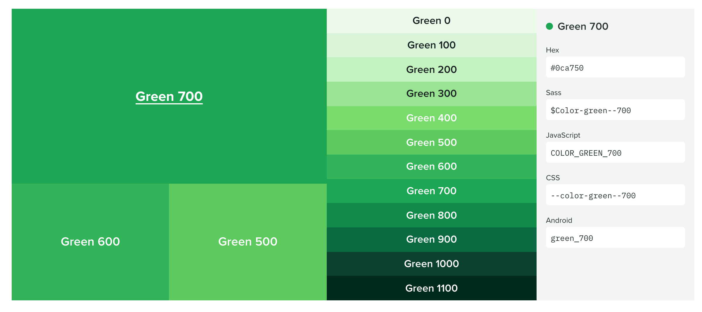

[REI Cedar](https://rei.github.io/rei-cedar-tokens/) doesn't include the all the different names for every token, they do show how you can translate the name to each platform, which is cool. 

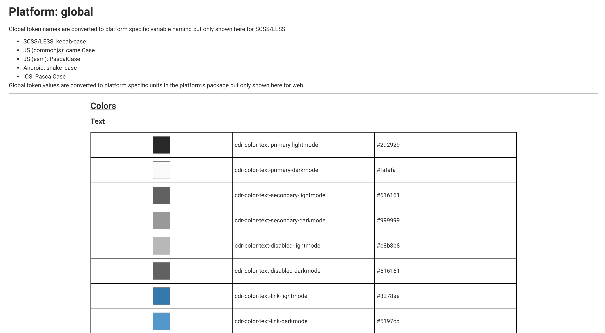

#### Tabs

[Thumbprint](https://thumbprint.design/tokens/scss/) has tabs for each language, SCSS and Javascript, and all the tokens broken down by type. Each tab also shows how to install and import the tokens for each language. I also like its simple clean style, it is easy to read and understand. [Backpack](https://backpack.github.io/tokens/spacings) also uses tabs for each language. If you notice, some of the tokens have slightly different names and values. [Uniform Huddle](http://uniform.hudl.com/guidelines/colors/content/code?web) also uses tabs to toggle between different platforms.

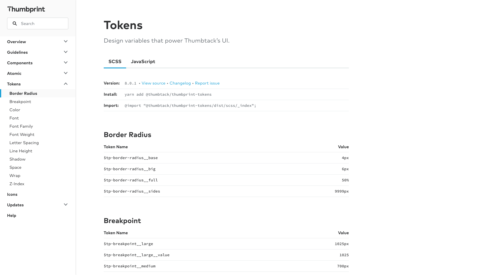

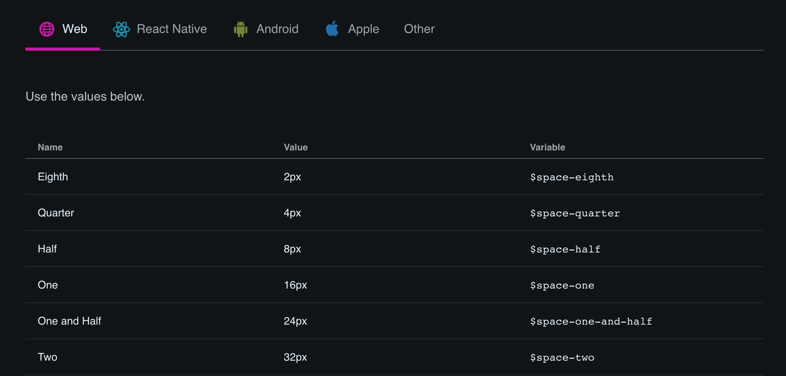

#### Dropdown

[Salesforce Lightning]() and  use a dropdown to select the platform for the token name.

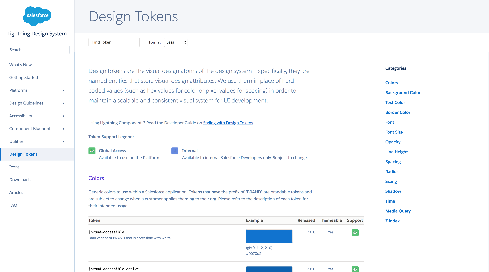

### The Name

### The Value

Design tokens have a value, which can be represented in text like "#ff9900". Design tokens describe visual attributes so they can also be displayed visually. You can display that color  as a rectangle like a swatch, text of that color, or something else like a chart with the color being used. 

### Description

[Salesforce Lightning](https://www.lightningdesignsystem.com/design-tokens/) has descriptions for each of the tokens which provides information about the use and why it exists. Having descriptions like this helps users understand more 

[Bitmani HEx](https://design.bitnami.com/category/Design-Tokens) has very good descriptions for each of their tokens. Some even have code and links in them!

### Additional Attributes

Some design tokens have extra attributes or metadata that is shown as well. Salesforce Lightning shows 3 extra attributes: what version it was released in, if it is themeable, and if it is for internal or external use. 

### Search & Filter

Depending on your use case, search might be an invaluable feature or potentially something that is rarely used. Searching for tokens 

[Basalt Crux](https://design.basalt.io/design-tokens/all-tokens) allows you to search (filter) by name or value. 

Although I haven't seen this yet, you could make search more useful by adding search terms in the metadata of each token. This could be helpful if you have a lot of tokens and it might be hard to remember the exact token you are looking for.

### Copy

To be honest, a copy button is something I have overlooked when I documented tokens in the systems I've worked on, but I think it is incredibly useful. [Orbit Kiwi](https://orbit.kiwi/design-tokens/) has a token page that gives you buttons to copy the name and value of the design token. [Basalt Crux](https://design.basalt.io/design-tokens/all-tokens) also lets you copy the name and value, although it is a bit hidden: you have to click on the name or value and it copies it to your clipboard!

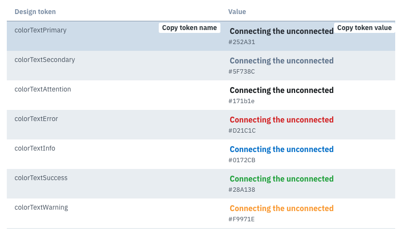

----

## Experimental Features

These are things I haven't seen yet in public design systems, but in my work at Amazon as well as thinking about design tokens a lot and talking to a lot of people about them, I have some ideas...

### 🔍 Reverse Lookup

As your token library grows, one thing that would be interesting to see is a reverse lookup of token aliases. This will show for a given alias, which tokens use it. You could also do this recursively for alias chains. So for a color in the core palette, like grey-10, which tokens reference that color? To be honest, I don't have a great use case for what problem that would solve, but I think it would be more of a "cool" feature.

### ✏️ Live Editing

Your design system documentation site is using live components and production code right? Depending on how you integrate the design tokens with your web components and documentation site, you could allow for live editing of the tokens to see their effect. If you use CSS variables (custom properties) or CSS-in-JS solutions you could be able to achieve this functionality purely on the client-side. I think this would be a very useful feature to teach designers and developers how the token system works and to see cascading changes. 

### Object Explorer

If you define your design tokens in an object fashion, either by using an actual nested object or by inferring an object structure in the token name, you can have an interactive object explorer. 

----

## Types of tokens

Different types of tokens can have interesting displays and information specific to the type of token. In this section I will take you through some cool features that relate to specific types of design tokens. 

### 🎨 Colors

Color pages are generally where I am initially attracted to. I feel like design systems generally tend to go all out and make really cool color pages. 

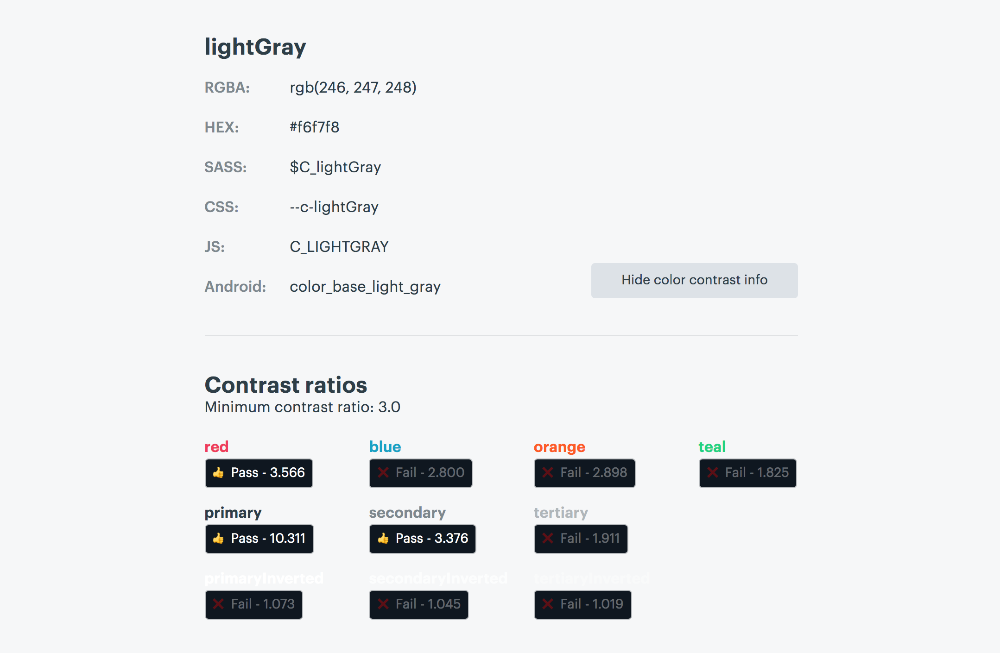

### 📐 Sizes

To be honest, I wish there was a little bit more to see for size tokens. 

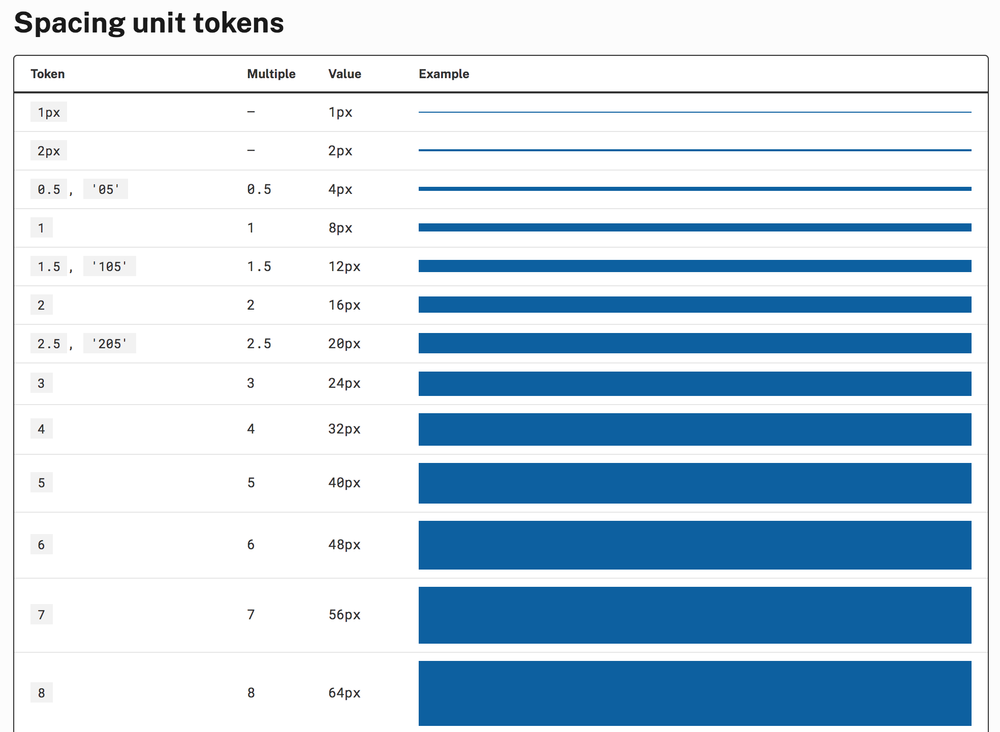

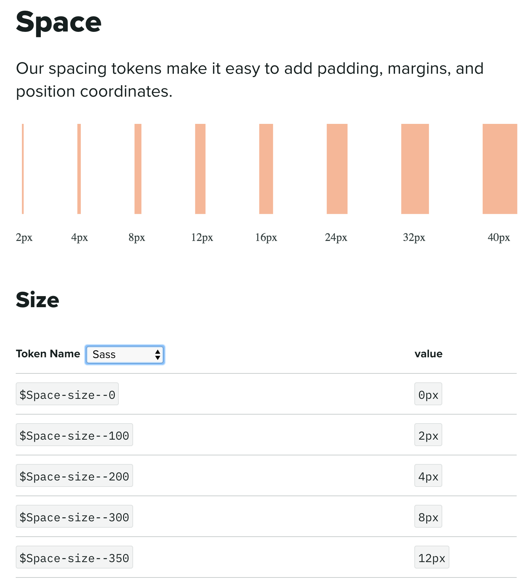

### 📝 Typography

First, I'll talk about 'simple' typography tokens: ones that specify a single value like font size, font family, font color, line height, etc. Some design systems separate out each of those into their own type, like [Salesforce Lightning](https://www.lightningdesignsystem.com/design-tokens/). Others put them all under a typography page like [Infor](https://design.infor.com/guidelines/identity/typography) and 

[Thumbprint](https://thumbprint.design/tokens/scss/#section-font) takes an interesting approach where they group typography tokens together, showing all the tokens (size, line height, weight, etc.) for a single style together, but also showing the raw values organized by type below.

Typography is interesting in that there are 'compound' tokens, ones which group multiple lower-level tokens together. For example you might have a 'heading1' token that has font-size, color, line-height, and letter-spacing values. I won't get too far into the different ways to do this, that deserves its own article. 

### 🎬 Motion

I think there is a lot of untapped potential in documenting motion tokens. There are some really cool things 

Here are some examples that do some cool things documenting motion tokens:

[Sprout Social Seeds](https://sproutsocial.com/seeds/visual/motion) has an amazing page about motion. It includes in depth principles and guidelines in addition to displaying the tokens. The motion token documentation though is where the fun happens. Each easing token has a chart, a full paragraph description, an example animation, and names for each language in addition to the raw value. It also includes a lot of external resources at the bottom of the page, which is really cool to see in a design system. Sprout Social Seeds is also pretty easy on the 👀.

### 💬 Icons

Depending how you implement your icons, either with SVG, an icon font, or something else, you can show the actual icon in the documentation. If you use an icon font, don't judge that is currently what I'm doing, it can be useful to allow users to copy the icon so they can paste it in their design tool assuming they have the icon font installed. If you have a lot of icons, it might be a good idea to be able to search them as well.

Descriptions I think can be very valuable for icon tokens specifically so you can let users know when to use the icon. 

### 🌫 Shadow

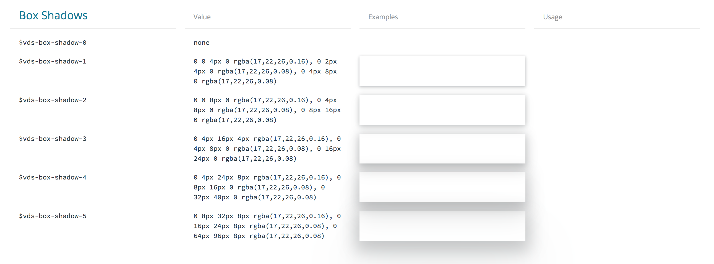

### 📱 Media Query

Media query tokens are a bit more rare than others, but there are some good examples. 

[Basalt Crux](https://design.basalt.io/design-tokens/all-tokens) shows their media query tokens in a graphic that shows common phone screen sizes and where the media queries are. This is a great visualization to understand which media queries target which class of device. 

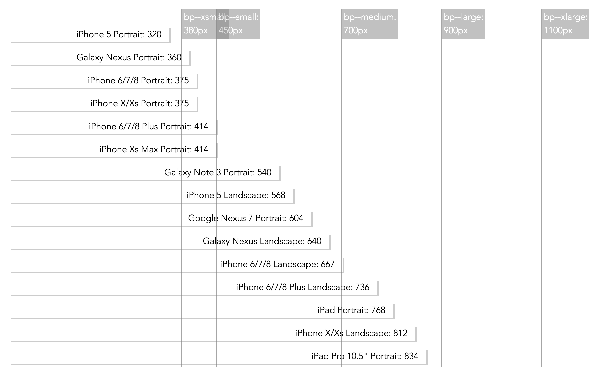

----

I was going to include *how* to go about documenting design tokens with actual code examples, but it felt like too much for one article. So stay tuned for an article on how to document design tokens whether you are using Theo, Style Dictionary, or something else.

Thank you to everyone who helped with this article, and to all the design systems featured in this article. You are all making the community better! ❤️

If you have a design system that uses design tokens that is not featured in this article, let me know on Twitter: [@dbanksdesign](https://twitter.com/dbanksdesign)

----

## Appendix

List of design systems and open source code if available used in this article:

<DesignSystems />

<!-- Markdown table
https://github.com/gwyneplaine/tokens-distribution-spike/blob/master/config/customFormats/index.js -->