import DesignSystems from './DesignSystems'

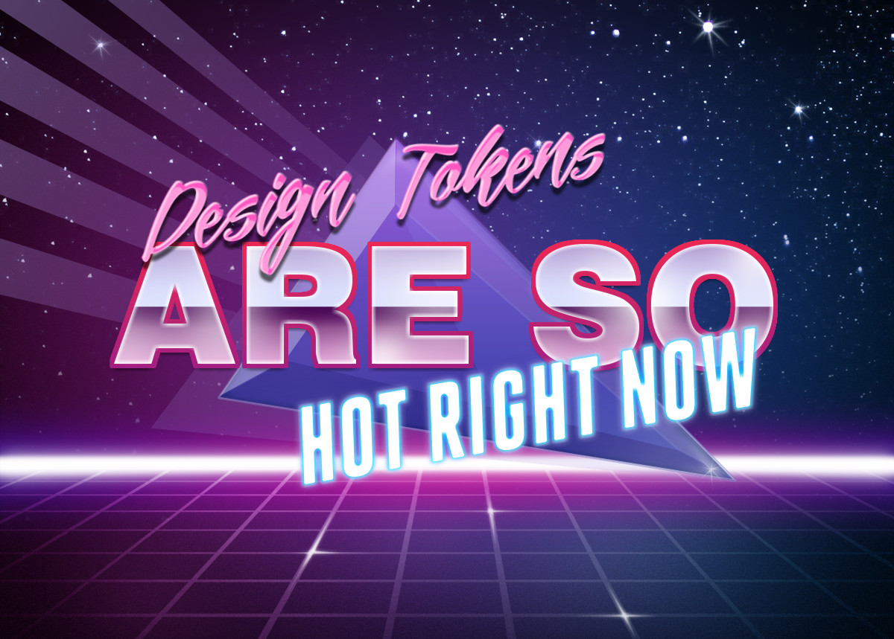

## Introduction

In this article I will show you all the cool things people are doing to document design tokens. Hopefully, you will learn something new you can take back to your design system. Before we get started, a few quick notes.

1. I am specifically **not** writing about naming conventions, how to organize and build design tokens, how to distribute or use them, or anything not related to *documenting* them. [Stuart Robson](https://twitter.com/StuRobson) has a great Github repo that has articles and talks and tools if you want to know more about design tokens in general: [Awesome Design Tokens](https://github.com/sturobson/Awesome-Design-Tokens).
2. Some of the examples shown are CSS/SCSS variables and not cross-platform tokens but as [Sarah Federman](https://twitter.com/sarah_federman) succinctly put it, *"I would classify having CSS vars as design tokens anyway as long as there's a design intent behind how they're named and used."*
3. I will try to not say certain things are better than others, or what you should or shouldn't be doing in your design system. Each team and product has their own needs, and I can't tell you what will work for you. Instead I want to give you tools, information, and inspiration so hopefully you can improve your design system in ways that makes sense for you. 
4. **⚠️ There are a lot of images in this article. They are lazy loaded, but be warned if you are not on wifi before scrolling.**

This is a longer article so it is broken down into sections. First, we will look at where design tokens generally exist in the information architecture of design systems. Then we will dive into features of design token documentation in general such as search and copy. Finally we will look at different types (color, size, motion, etc.) of design tokens and their unique features. In the appendix I have a list of all the design systems with design token documentation that I have found, with links to source code if available.

---

## Overview

### Information Architecture

Let's start with where design tokens are generally documented in design systems. Some design system websites have a dedicated 'Design Tokens' page that includes all design tokens, in addition to information about design tokens in general. Others put them in 'Style' or 'Foundation' sections with pages for each type such as 'Color' and 'Size'. Some do both. Doing both can be helpful because they are solving different problems. Having style pages like 'Color' lets you add more content and guidance around color usage. It can also be helpful to see a page with all the design tokens if you are searching for a specific token, or to learn about what design tokens are and how to use them.

Style/Foundation pages let customers know *how* to apply color, typography, size, motion, etc. A design token page is generally more about the *what* design tokens are  and how to use them in code. 

### Design Token Overviews

A lot of design system websites have some content explaining the concept of design tokens. Apart from the specific token usage, they show how to import and use the tokens in general like how to import the token package.

[Infor Design System](https://design.infor.com/guidelines/identity/design-tokens) has a very detailed design tokens page that explains what design tokens are, how to install and use them, a list of all tokens, and dives deep on different levels of tokens and their naming convention. 

[Sprout Social Seeds](https://sproutsocial.com/seeds/resources/tokens/) separates the tokens by type and puts them in different packages, each versioned independently, and shows how to install them. What is cool about this token page is it has links to the built artifacts teams would be importing so they can see what the files actually look like. 

[US Web Design System](https://designsystem.digital.gov/design-tokens/) has 'Design tokens' in the top-level navigation with an overview page, and sub-pages for each type of design token. I especially like this quote on their page:

> Design tokens are a limited set of discrete options, just like a scale of musical notes is drawn from the spectrum of all possible frequencies. Or like the presets on a car radio — not every option, just a specific selection.  
> — <cite>[US Web Design System](https://designsystem.digital.gov/design-tokens/)</cite>

---

## Features

Now lets take a look at some of the features used when documenting design tokens. 

### Platforms

Design tokens are used in multiple platforms and languages so you have to decide how you want to display the usage for each. A token on a specific platform might have both a different *name* and a different *value*. Some design system  sites show all names and/or all values by default. Others let you toggle between the supported languages either with a dropdown or tabs.

*Note: I will use 'platform' and 'language' interchangeably*

[Sprout Social Seeds](https://sproutsocial.com/seeds/visual/color) and [Meetup Swarm](https://meetup.github.io/swarm-design-system/design/color/) show the token name for all platforms. 

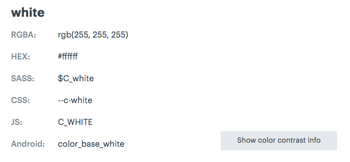

[REI Cedar](https://rei.github.io/rei-cedar-tokens/) doesn't include the all the different names for every token, they do show how you can translate the name to each platform, which is cool. 

[Thumbprint](https://thumbprint.design/tokens/scss/) has a tab for each language it supports, and each tab shows how to install and import the tokens. I really love its clean style, which makes it easy to understand. [Backpack](https://backpack.github.io/tokens/spacings) and [Uniform Huddle](http://uniform.hudl.com/guidelines/colors/content/code?web) also use tabs to toggle between different platforms. [Salesforce Lightning](https://lightningdesignsystem.com) uses a dropdown to select the platform for the token name.

<!-- The last platform switcher I want to show is Badoo's design system. They have a platform switcher for their whole design system, and they use icons which look nice. They also have a brand switcher as well, which affects the token values.

<video loop="true" muted="true" autoplay="true" playsinline="true">
  <source src="images/badoo.mp4" type="video/mp4" />
</video> -->

### Alias

Design token values can be a reference to an *alias* of another value. If you have aliased tokens it can be helpful to show the reference in the value as well as the resolved value. [Salesforce Lightning](https://lightningdesignsystem.com/design-tokens) does this.

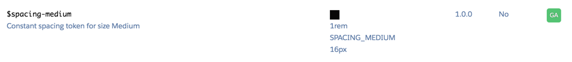

<!-- 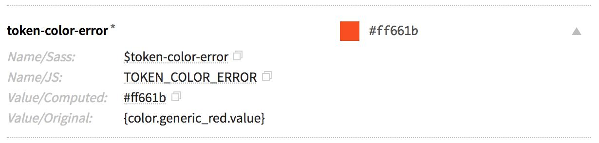 -->

### Description

[Bitnami HEx](https://design.bitnami.com/category/Design-Tokens) has very good descriptions for each of their tokens. Some even have code and links in them! [Salesforce Lightning](https://www.lightningdesignsystem.com/design-tokens/) also has descriptions for each of the tokens which provides information about its use and why it exists. Having descriptions like these can help users understand how to properly use each token.

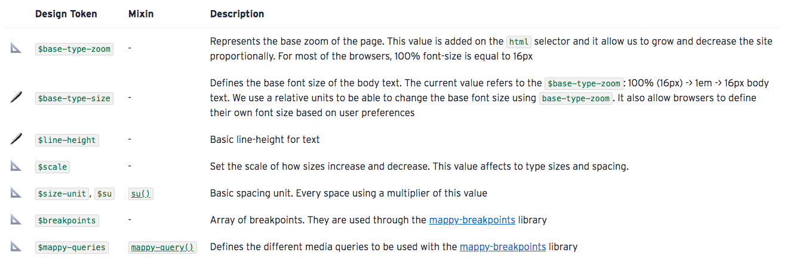

### Additional Attributes

Some design tokens have extra attributes or metadata that is shown as well. Salesforce Lightning shows 3 extra attributes: what version it was released in, if it is themeable, and if it is for internal or external use. 

### Search & Filter

Depending on your use case, search might be a valuable feature for your design system. [Basalt Crux](https://design.basalt.io/design-tokens/all-tokens) allows you to search (filter) by name or value. 

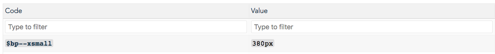

Although I haven't seen this yet, you could make search more useful by adding search terms in the metadata of each token. This could be helpful if you have a lot of tokens and it might be hard to remember the exact token you are looking for.

### Anchors

If you have design token pages that are really long, it can be a good idea to provide anchor links so your users can send or bookmark the exact location of the documentation. A lot of design systems do this, for example [Mineral UI](https://mineral-ui.com/tokens), [Sprout Social Seeds](https://sproutsocial.com/seeds/visual/motion), [Thumbprint](https://thumbprint.design/tokens/scss/), and [Udacity Veritas](https://veritas.udacity.design/tokens/).

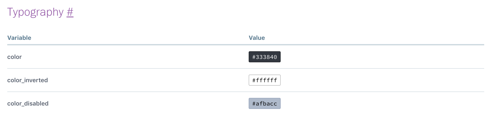

### Copy

To be honest, a copy button is something I overlooked when I documented tokens in the systems I've worked on, but I think it is incredibly useful. [Orbit Kiwi](https://orbit.kiwi/design-tokens/) and [Formstack](https://www.formstack.com/brand/design-system/tokens) have token pages that give you buttons to copy the name and value of the design token when you hover over the token. [Basalt Crux](https://design.basalt.io/design-tokens/all-tokens) also lets you copy the name and value, although it is a bit hidden: you have to click on the name or value and it copies it to your clipboard.

### Editing

This is something that I recently found in the new [Shopify Polaris Icons](https://polaris-icons.shopify.com) site. You can click on an icon and there is a link to edit the metadata of the icon. This link takes you to the file on Github where you can edit it right there! If you are using Github you can substitute 'blob' for 'edit' in the URL for a file in a repository to link to a directly editable file. This is something that would be useful to apply to more than just design tokens, but you could have it for documentation pages, and even components!

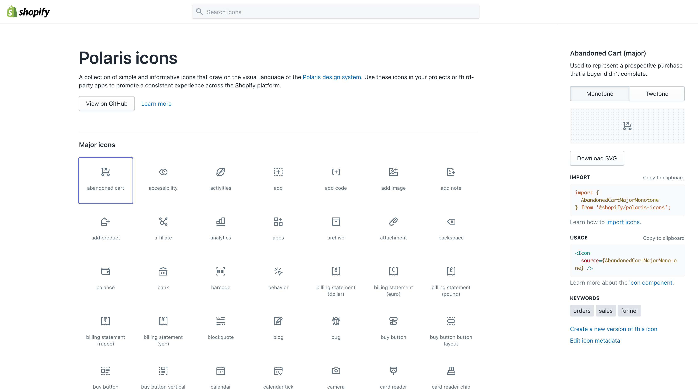

### Issues

This is also something not specific to design tokens, but I think is important enough to mention here as it can be super useful. Adding a link to file an issue on design tokens, showing a list of open issues or linking to a filtered list of issues about design tokens is something I would love to start seeing in design systems. Again, [Shopify Polaris Icons](https://polaris-icons.shopify.com) site does this with the 'Create a new version of this icon' button which takes the user to an issue template on Github.

----

## Experimental Features

These are things I haven't seen yet in public design systems...

### 🔍 Reverse Lookup

As your token library grows, one thing that would be interesting to see is a reverse lookup of token aliases. This will show for a given alias, which tokens use it. You could also do this recursively for alias chains. For a color in the core palette, like grey-10, it can show which tokens reference that color.

### ✏️ Live Editing

Your design system documentation site is using live components and production code right? Depending on how you integrate the design tokens with your web components and documentation site, you could allow for live editing of the tokens to see their effect. If you use CSS variables (custom properties) or CSS-in-JS solutions you could be able to achieve this functionality purely on the client-side. I think this would be a very useful feature to teach designers and developers how the token system works and to see cascading changes. 

### 🏔 Object Explorer

If you define your design tokens in an object fashion, either by using an actual nested object or by inferring an object structure in the token name, you can have an interactive object explorer. This can be helpful to visualize the structure and organization of all the design tokens used. 

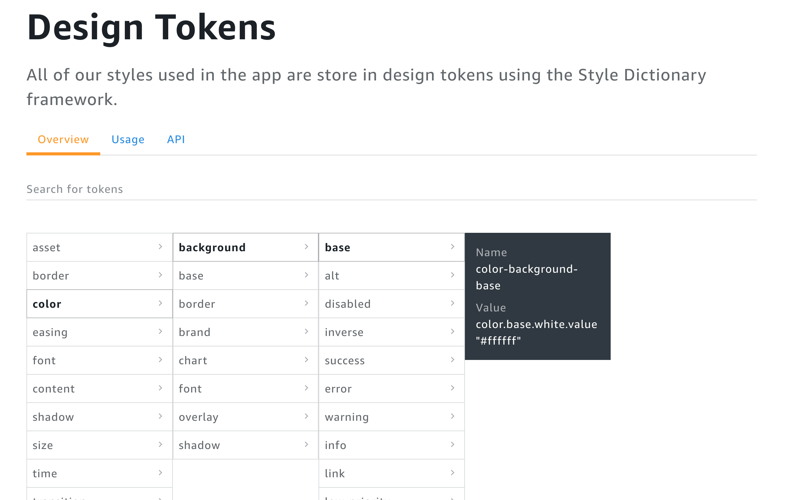

----

## Token Types

Different types of tokens can have interesting displays and information specific to its type. Also you can put content and functionality specific to the type of token. 

### 🎨 Colors

Color pages are generally the most visually pleasing of the bunch. Design systems generally tend to go all out and make really cool color pages. One of the most common displays for colors are color ramps that show all the shades of each type of color, like [Kalo design system](https://kalo.design/foundations/color/) and [Mineral UI](https://mineral-ui.com/color) which shows HSL values and accessibility ratings.

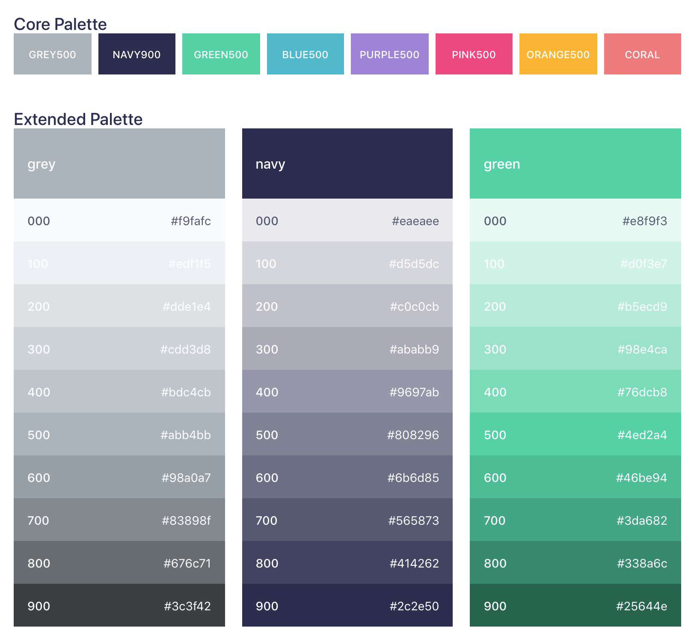

[Meetup Swarm](https://meetup.github.io/swarm-design-system/design/color/) displays color contrast information as well for all their text colors on background colors.

Some color pages also break down colors by use: text, background, border, etc. and show examples like [Udacity Veritas](https://veritas.udacity.design/tokens/#border-color).

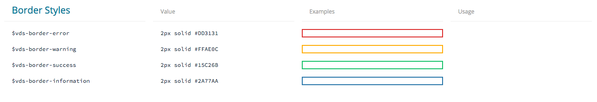

### 📐 Size & Spacing

Most of the time I see sizes being shown as a square of the value, shown below. [US Web Design System](https://designsystem.digital.gov/design-tokens/spacing-units/) shows the multiple (1x, 2x, etc.) of the value along with the absolute value which makes it easy to see the rhythm. 

### 📝 Typography

First, I'll talk about 'simple' typography tokens: ones that specify a single value like font size, font family, font color, line height, etc. Some design systems separate out each of those into their own section, like [Salesforce Lightning](https://www.lightningdesignsystem.com/design-tokens/). Others put them all under a typography page like [Infor](https://design.infor.com/guidelines/identity/typography). [Thumbprint](https://thumbprint.design/tokens/scss/#section-font) takes an interesting approach where they group typography tokens together, showing all the tokens (size, line height, weight, etc.) for a single style together, but also showing the raw values organized.

[Udacity Veritas](https://veritas.udacity.design/tokens/) has a lot of typographic design tokens, even ones for line-height, max-width, and font-weight. I really like how they display line-height tokens with borders so it is easy to visualize:

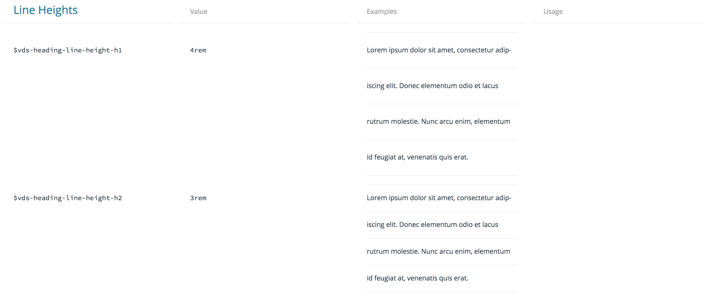

Most design systems show some example text styled with the design token, like [US Web Design System](https://designsystem.digital.gov/design-tokens/typesetting/font-size/). [Sprout Social Seeds](https://sproutsocial.com/seeds/visual/typography#typefaces) typography token page has an editable text box so you can see your text styled with different tokens.

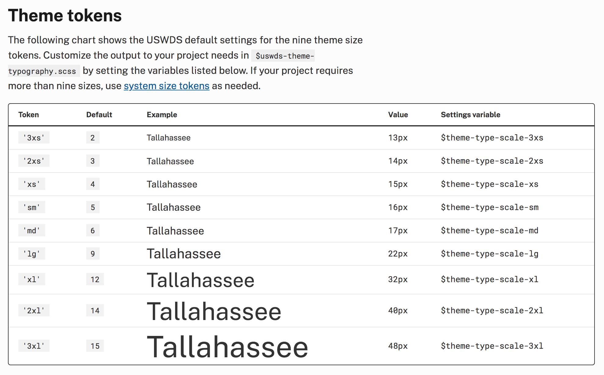

Typography is interesting in that there are 'compound' tokens as well; ones which group multiple lower-level tokens together. For example you might have a 'heading1' token that has font-size, color, line-height, and letter-spacing values. I won't get too far into the different ways to do this, that deserves its own article. [Sprout Social Seeds](https://sproutsocial.com/seeds/visual/typography#typefaces) has a typography picker and an editable text area so you can customize the text:

### 🎬 Motion

I think is a lot of untapped potential in the documentation of motion tokens. When I write the next version of this article, I really hope there will be some more examples of motion tokens. Luckily, I did find one really great example. [Sprout Social Seeds](https://sproutsocial.com/seeds/visual/motion) has an amazing page about motion that includes in-depth principles and guidelines in addition to displaying the tokens. The motion tokens themselves are where the fun happens. Each easing token has a chart, a full paragraph description, an example animation, and names for each language in addition to the raw value. It also includes a lot of external resources at the bottom of the page, which is really cool to see in a design system.

<video loop="true" muted="true" autoplay="true" playsinline="true">
  <source src="images/motion.mp4" type="video/mp4" />
</video>

### 💬 Icons

Most design systems show the actual icon itself, as well as the name or string to reference it.If you have a lot of icons, it might be a good idea to have them searchable. Grouping icons by use, for example action, status, or social, can be useful. [Kalo design system](https://kalo.design/foundations/icons/) has groups of icons and the ability to search all icons.

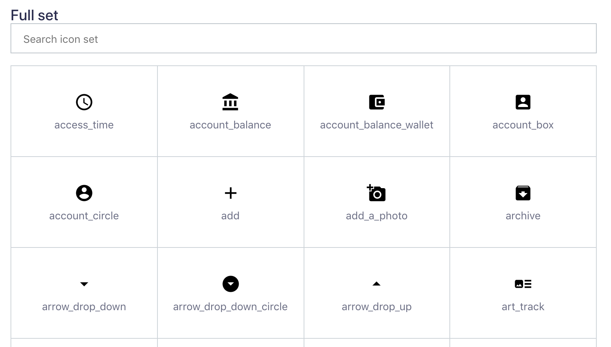

Being able to copy or download a specific icon can be useful for people trying to add an icon to a mockup or wireframe. If you use an icon font you could allow the unicode character to be copied, or if you use SVG you could also copy the full SVG string into the user's clipboard. The [Infor design system](https://design.infor.com/guidelines/identity/icons) provides buttons to download SVG and PNG versions of the icon when you hover over them. [Shopify Polaris](https://polaris-icons.shopify.com) also lets you download the SVG of an icon.

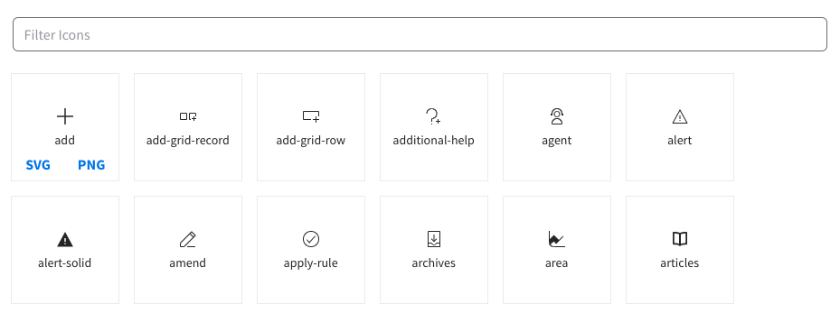

### 🌫 Shadow and Elevation

Unfortunately there are not a lot of examples of shadow and elevation tokens. But [Udacity Veritas](https://veritas.udacity.design/tokens/#box-shadow) and [Sprout Social Seeds](https://sproutsocial.com/seeds/visual/elevation) show shadow and elevation respectively:

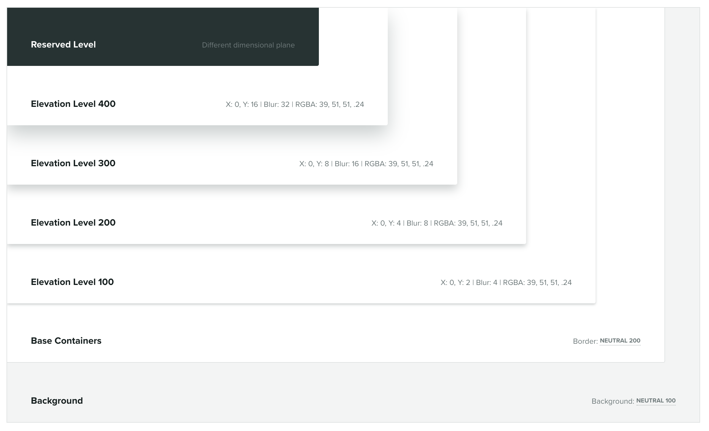

### 📱 Media Query

Media query tokens are a bit more rare than others, but [Basalt Crux](https://design.basalt.io/design-tokens/sizing) has a good example. It shows their media query tokens in a graphic that shows common phone screen sizes and where the media queries are. This is a great visualization to understand which media queries target which class of device. 

----

I was going to include *how* to go about documenting design tokens with actual code examples, but it felt like too much for one article. So stay tuned for an article on how to document design tokens whether you are using [Theo](https://github.com/salesforce-ux/theo), [Style Dictionary](https://amzn.github.io/style-dictionary), or something else.

Thank you to everyone who helped with this article, and to all the design systems featured in this article. You are all making the community better! ❤️

I apologize if I missed your design token documentation in this article. If you have a design system that uses design tokens that is not featured in this article, let me know on Twitter: [@dbanksdesign](https://twitter.com/dbanksdesign)

----

## Appendix

List of design systems using design tokens I found for this article:

<DesignSystems />