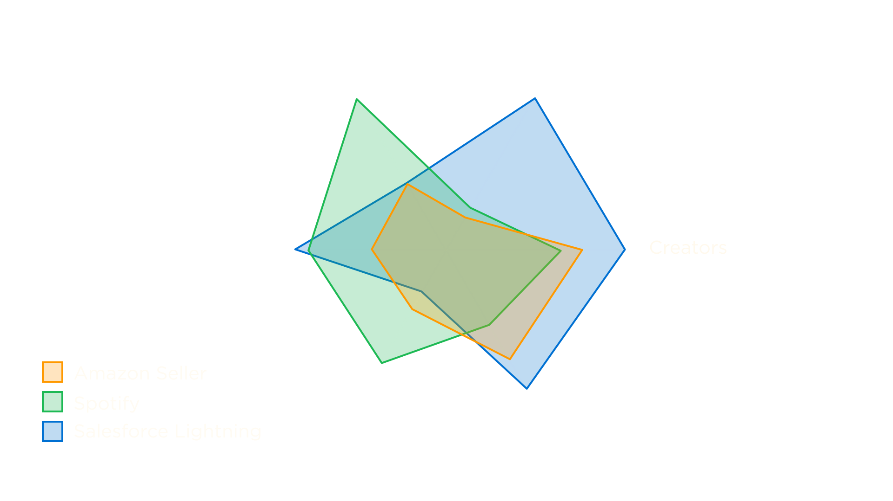
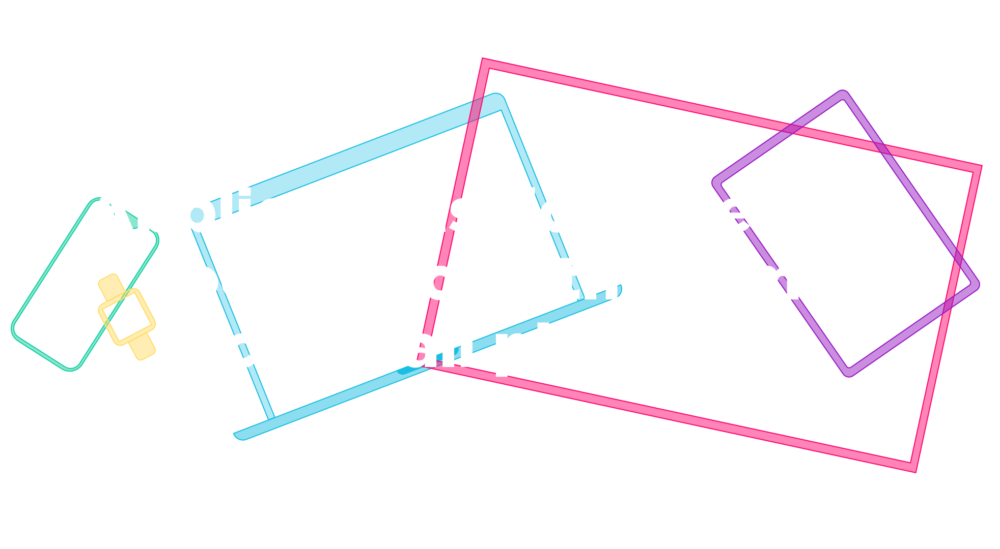
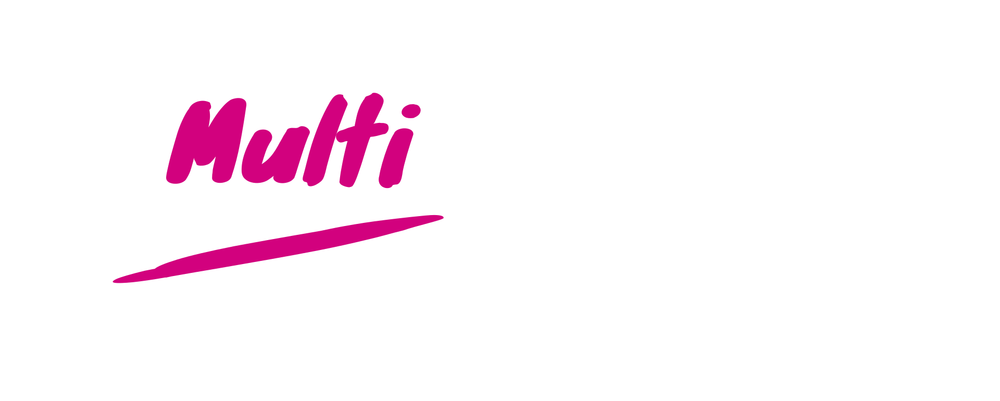
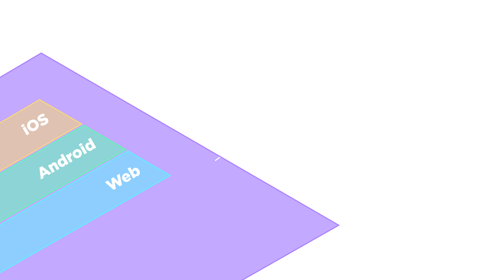
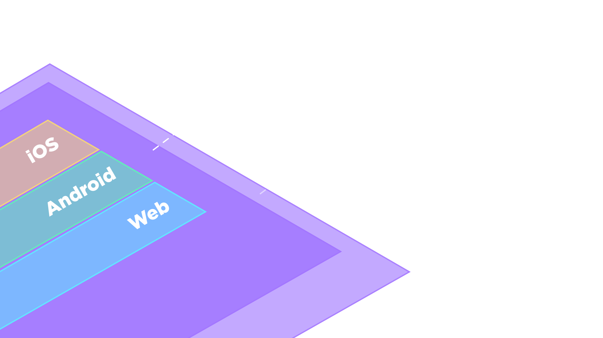
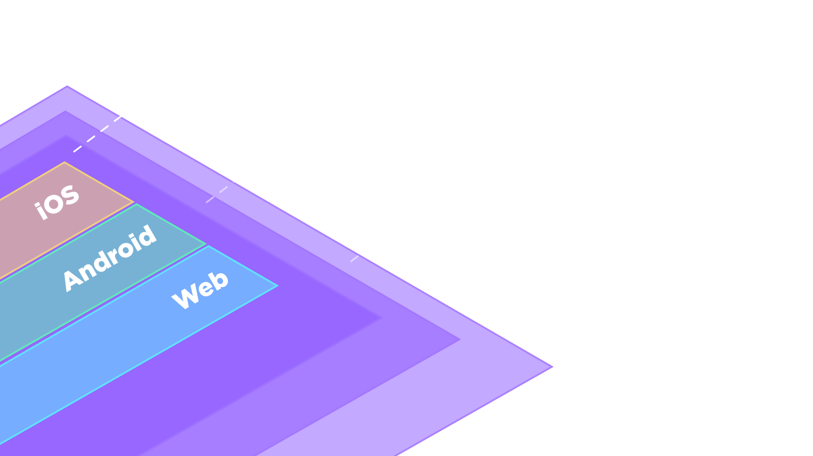
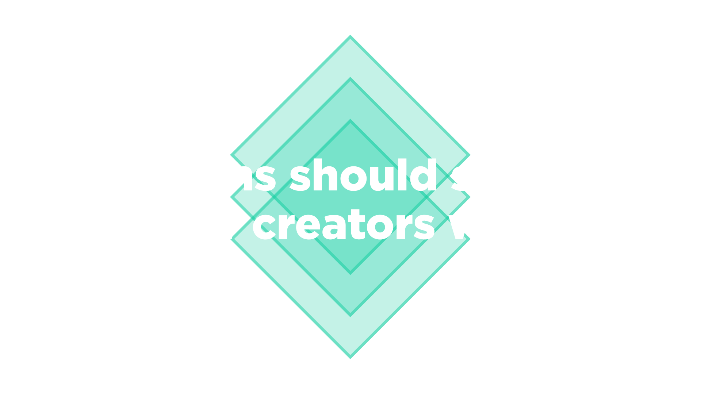
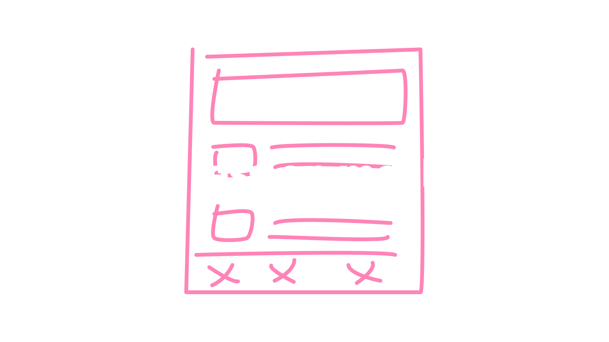
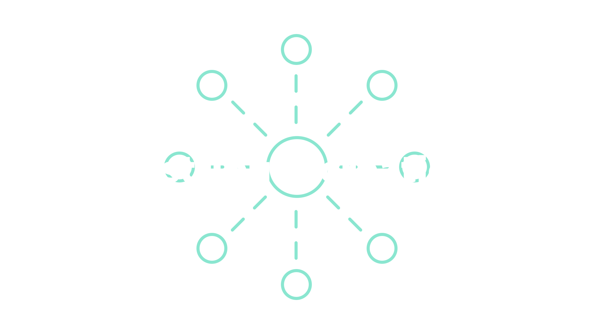

**Did you know that <mark>less than 10%*</mark> of public design systems support platforms other than the web?**

The web is the default language of design systems right now. Any discussion about design systems is assumed to be talking about the web. And I get it. I love the web. The web is an amazing medium, but it is not the only way our customers interact with our products. A lot of the products we work on are not just web applications. As a community I want us to break outside web centric mindset and take a more holistic view to include all the ways we can help deliver experiences to our customers. Let's explore some the ways we can incorporate other platforms into our design systems. I want to start with a disclaimer: 

**There is no single right way to support multiple platforms with your design systems.** Different products and organizations have different needs. Here are the public multi-platform design systems that I have found:

* [Salesforce Lightning Design System](https://www.lightningdesignsystem.com/)
* [Shopify Polaris](https://polaris.shopify.com/)
* [Skyscanner Backpack](https://backpack.github.io/)
* [REI Cedar](https://rei.github.io/rei-cedar-docs/)
* [Hudl Uniform](http://uniform.hudl.com/)
* [Thumbtack Thumbprint](https://thumbprint.design/)
* [Microsoft Fluent](https://www.microsoft.com/design/fluent/#/)
* [Google Material](https://material.io/)

*If I missed your multi-platform design system, my bad! [Let me know on Twitter!](https://twitter.com/dbanksdesign)*

How each of these design systems support multiple platforms looks very different because they all have different needs:

* The number of **platforms and applications per platform** you support
* The number of **creators** in your organization *(I use the term creators or makers because I don't want to differentiate developers or designers, they are all part of the creation process)*
* How **centralized or decentralized** your organization is
* How **differentiated** users expect experiences to be on different platforms
* How important feature **parity** is



These are some of the factors that can affect how your multi-platform design systems might look like. My organization at Amazon has a few thousand employees, and we support 3 platforms, one application per platform, we are pretty decentralized. Spotify supports 45 platforms which is insane! Salesforce Lightning supports many applications per platform, first party and third party.

These are all very different sets of challenges and different needs. But I want to look at the commonalities across all of them. Let's start with 2 of fundamental goals of design systems: *efficiency and consistency*. Organizations can deliver more features and a more consistent experience to customers, everyone wins. These goals take on a different shape when we start thinking about building for multiple platforms.

Let's start with consistency. I actually **don't** like the word "consistency" because it can imply a false binary. Something is either consistent or inconsistent. But when we look at products across multiple platforms it is not all or nothing. There are *layers* of consistency. Instead of consistency, I use **cohesion**. You can use platform-specific components and conventions and still feel cohesive across platforms. This is sometimes called being a good "platform citizen", respecting platform conventions while still having a branded application because


Most customers don't switch between platforms of the same device, most of us have 1 phone or 1 computer. Customers move across devices. I use the Twitter web app on my laptop and the Android app on my phone. I use Netflix on my Android phone, on a web browser on my laptop sometimes when I'm watching Forensic Files in bed, but most likely I use it on my TV. And I expect Netflix to function quite differently on my TV, phone, and laptop. The types consistency and parity across platforms I expect depends on the type of product, but cohesion of the applications is really what matters.



I use the term "multi-platform" as opposed to "cross-platform" intentionally. On the surface, they might seem the same and people may use them interchangeably. However, I think the term "cross-platform" has a lot of baggage and history. It carries expectations that something looks and functions the same on all platforms. Multi-platform to me means multiple platforms are supported, but the implementation or experience might be different. **To have multi-platform design systems does not mean everything needs to look and function the same across all platforms.** Or that all UI code and components have to be shared across platforms. Let's take a look at how to build cohesion across applications on different platforms.



Let's say you have web, android, and iOS applications. Right now their UIs are completely separated and siloed, they share a backend for their data but front-ends are all built separately. Let's build foundations for all platforms to be built on.



These foundations are the principles, voice & tone, brand, communications and any foundation common to all platforms. This is the first layer of cohesion across platforms because voice & tone, content guidelines, localization, etc. all apply to any platform. One thing that might be overlooked, but incredibly important is having a unified communication strategy across platforms. If mobile apps send push notifications that conflict with a notifications list on a web app, or emails sent to customers, it creates a very disjointed experience. Having non-technical mechanisms like documentation, guidelines, and internal communication is good start. When your organization begins to scale it makes sense to have a service that manages all outgoing communication from your product and orchestrates messages and notifications for each channel. This creates *brand and voice cohesion* across platforms.



People who know me and my work might have expected this entire article to revolve around design tokens, but design tokens are just a single part of multi-platform design systems. Design tokens are important for though to define the look and feel in a platform-agnostic way so that any platform can use the same visual design attributes. This creates the *visual cohesion* between platforms. 



Component names, APIs, documentation, and guidelines: these can be shared even if they are implemented differently on each platform. For example, there could be a web component, an Android component in Kotlin or Java and used in a layout XML file, and a Swift class for iOS. They all have the same name (or similar based on language constructs) and the same properties. The actual implementation, how the component looks, can differ, but they are functionally the same.

```html
<example-banner
  variant="warning"
  title="Uh oh"
  description="Something bad happened" />
```

```xml
<com.example.component.Banner
  app:variant="warning"
  app:title="Uh oh"
  app:description="Something bad happened" />
```

```swift
let banner = Banner(
  variant: .warning,
  title: "Uh oh",
  description: "Something bad happened"
);
```

A great example of this is Google Material, there are iOS, Android, Flutter, and Web implementations, but the components share common definitions. One thing I want to point out is that every component doesn't need to be shared across all platforms. But these differences should be intentional. Unintentional divergence can be frustrating. It is frustrating when there is an Alert component for the web and a Banner component for mobile, where both serve the same purpose. It is frustrating when these two components have similar but not the same APIs. One has a "variant" property and the other has a "type" property. The available options for both are slightly different for each, one has "error" and the other has "danger". This is not a hypothetical situation. I know this frustration because this example is from the web and mobile design systems I currently work on. What would have helped our case is if this article written by the Lyft design systems team came out a few years earlier which explained how they design and build in parallel. 

> We design and build in parallel so any discussions on details that come up during implementation (and there are usually many) get addressed and considered together.
> <cite><a href="https://www.designsystems.com/a-system-built-on-parity-how-to-treat-all-of-your-users-equally/">A system built on parity: How to treat all of your users equally</a><br/>
> by Linzi Berry, Kathy Ma, Sam Soffes at Lyft</cite>

My organization went through a lot of pain when we defined and built a component for one platform and then tried to port it to another platform. The component API and definition was built in a very platform-centric mindset. It was an Android component we needed to bring to iOS, or a web component we need to bring to mobile. One mechanism my team is working on is documentation driven development. Writing the docs for a component and the sample code before writing any actual code. This helps us think through the problem we are solving and to make intentional choices to diverge or converge the platforms. You might be thinking to yourself: why implement a component 3 times, why not just do it once by embedding webviews in native applications with something like Cordova or Electron, or using a framework like React Native or Flutter? I love each and every multi-platform framework, even you Xamarin. Using a framework or webviews is not always the right answer, it sometimes is. 



Remember the radar chart above? Depending on how many applications per platform your design systems support, and how important differentiation and parity between platforms is, a framework might make sense. The Salesforce Lightning design systems need to support many different applications so they have design token packages on each platform instead of building component implementations using a multi-platform framework. My organization decided the best thing for our customers was to have separate mobile and web experiences, but we did not want the creators having to build separate Android and iOS experiences. We built our systems to support this. 

Now we are starting to talk about *how* creators build experiences across platforms. Creating experiences across platforms is difficult, even if you do use a framework. Imagine you work on a product that has Android, iOS, and web applications and you wanted to add a feature across all of them. How would you do that? Do you have to design 2 or 3 sets of mockups, get design approval from different teams, make code changes in multiple codebases and languages, test them on different devices? The effort to deliver features could be more than tripled because this requires context switching and working in different environments! We need to remove that friction so that people are more efficient.

I'm going to do it again. I don't like "efficiency". Efficiency can lack humanity. I don't want creators mindlessly churning out features as fast as possible. Instead of thinking purely about efficiency, I think about *autonomy*. How the systems can make creating experiences more approachable to anyone so that creators have the autonomy and agency to build experiences for all platforms. We can do this by removing the friction and barriers of designing and building for multiple platforms and devices. 


One barrier with application development is setting up the development environments. You usually need to pull down the whole codebase, install dependencies and libraries, see an error message somewhere, google it, copy & paste something from StackOverflow, compile or build the app, then finally start coding. And you need to do that for each platform! Thats terrible. Instead, build low-friction ways to start creating in the design systems without having to set up a full development environment. To reduce that friction, my team built a development environment which lets people install a debug version of our mobile app on an Android or iOS simulator and start writing UI code on their computer without having to compile anything, without bringing in the full app codebase, and without setting up native Android and iOS tools. And it is running native code. No web-views or runtimes like React Native or Flutter. But that is a topic for another time.

<video loop="true" muted="true" autoplay="true" playsinline="true">
  <source src="images/recording.mp4" type="video/mp4" />
</video>



Designing multiple sets of mockups can be time consuming and draining. The less we can rely on mockups and the quicker we can get into production Relying less on mockups is possible because of the up-front work to design cohesive component APIs and shared definitions.

**Lowest fidelity to express intent**

This doesn't mean we never use design tools, but our focus is to reduce the collective time to go from idea to launch. We encourage people to use the lowest fidelity to express their intent to...

**Get to code quicker**

Getting to code quicker allows you to see the experience that customers see rather than an approximation of the experience. 

**Designer & developer pairing**

Rather than going back-and-forth with mockups and hand-offs, a lot of time and effort can be saved by pairing and building a production interface together. A designer and developer (or design technologist) can sit in a room we build production ready UI code for a feature in a few hours rather than days or weeks of back and forth.

We are trying to remove the barriers of creating experiences on different platforms so that is more accessible to more people. We still have a ways to go, because that is still a *development* environment. Our goal is to make it accessible to technical and non-technical people alike. There are interesting things out there like [Snack Expo](https://snack.expo.io/) for React Native and the [Seek Braid Design Systems Playroom](https://seek-oss.github.io/braid-design-system/playroom/) that are zero-install low-code creation environments that are steps in the right direction.



Relying less on mockups allows you to distribute the creation process throughout the organization. We want people to own their experience across all platforms it touches, rather than having teams siloed by platform.

**Spread ownership**

It is difficult to own experiences in different platforms and codebases. Removing the barriers and friction of developing and designing for multiple platforms allows you to spread the ownership throughout your organization. 

**Own the full experience**

Instead of thinking of features and experiences in a platform-centric mindset, we can work backwards from the customer problem to provide an excellent experience regardless of platform.

**Meet creators where they are**

This includes everyone, designers, developers, PMs. I have worked with a lot of teams building features, and they come in all shapes and sizes. Some teams have dedicated designers, front and backend developers, and want full control of their experience. Other teams might be a product manager and a developer, or maybe just an intern. Removing the barriers of design and development for all platforms allows anyone to create and own experiences and features across platforms. 


Meet customers where they are on different platforms and different devices. Giving them a cohesive experience as they move across devices. Meet creators where they are, building experiences for customers across those platforms. Rather than thinking about a feature for a single platform at a time, working backwards from the customer problem, agnostic of platform. Empower people to create cohesive experiences across platforms by cultivating **cohesion and autonomy** rather than consistency and efficiency. Everyone in your organization should feel empowered to build cohesive experiences for customers across platforms. 

---

By next year's Clarity I want to see **<mark>over 25%</mark> of public design systems support multiple platforms next year.**

This topic is still very new and there is a lot I didn't cover like comparing multi-platform frameworks like Flutter, React Native, and Xamarin, layout and component composition: flat v. nested components, other platforms like digital assistants, accessibility in native applications, or documentation of native components. I saw a demo recently from the folks at Intuit that displayed [native mobile components in Storybook](https://medium.com/@vasikarla.raj/storybook-for-native-d772654c7133) and they were actually being rendered natively! I am excited to see more innovations like these and see how other organizations incorporate platforms into their design systems.

I would love to talk more about this, please reach out to me on the [design systems slack](http://design.systems/slack/) or [twitter](https://twitter.com/dbanksdesign) if you want to talk more about multi-platform design systems. 👋

---

### Appendix

* [Thinking in Symbols for Universal Design - Benjamin Wilkins, Airbnb](https://www.youtube.com/watch?v=z5XxgxBz3Fo)
* [Balancing Platforms in a Design System - Nathan Curtis](https://medium.com/eightshapes-llc/finding-platform-balance-in-a-design-system-47eaae48de98)
* [Design Tokens and Cross Platform Coherence - Luca Ferretti](https://www.codemotion.com/magazine/dev-hub/designer-cxo/design-tokens-and-cross-platform-coherence/)
* [Cross-Platform Design: A look at Challenger Bank Mobile Applications - Courtney Yule](https://blog.scottlogic.com/2019/04/24/cross-platform-design-a-look-at-challenger-bank-mobile-applications.html)
* [The future of design systems - Roy Stanfield](https://www.designbetter.co/design-systems-handbook/future-design-systems)
* [The future of cross-platform is Native - Justin Mancinelli](https://www.youtube.com/watch?v=sA_JIqqj9js)
* [Mobile development in 2019: native versus cross-platform - Miriam Busch](https://www.youtube.com/watch?v=45JWJfss9GA)
* [Where We Can Go - Dan Eden](https://daneden.me/blog/2019/where-we-can-go)
* [Backend Driven Native UIs - John Sundell and Diego Cristina Capelo](https://atscaleconference.com/videos/backend-driven-native-uis/)