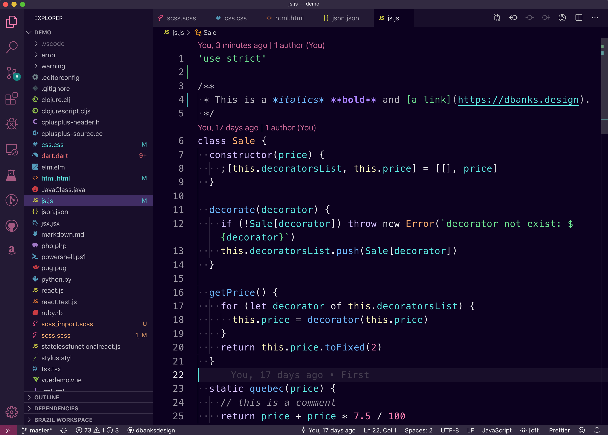

import Scopes from "./Scopes"
import Tip from "$components/Tip"



[TLDR Hey just show me the code!](https://github.com/dbanksdesign/nu-disco-vscode-theme)This is the code for the theme we are going to build. It is a Github template so you can start a new repository based on it. Hopefully the code will be easy to follow, I tried to document everything I was doing. If you want to install the theme, search for 'Nu Disco' in VS code extensions. Feel free to take it and modify it to create your own theme. If you do show it to me!

----

## Introduction

In this article I will show you how to build a Visual Studio Code color theme extension using [Style Dictionary](https://styledictionary.com). Throughout the process I will try to explain concepts about VSCode theme development so you can apply them when you are creating a theme even if you don't use Style Dictionary.

[Style Dictionary](https://styledictionary.com) is a framework written in Node for creating and managing design tokens. *Disclaimer: I am a maintainer on Style Dictionary.* If you would like to know more about design tokens, here are [some resources](https://github.com/sturobson/Awesome-Design-Tokens) and here is a [good introductory article](https://css-tricks.com/what-are-design-tokens/).

A VSCode theme file is a JSON file that defines colors and styles in a way that resembles design tokens: name-value pairs. Style Dictionary is a great tool for creating VSCode color themes for a few reasons:

1. You can break up the theme into multiple JSON, JSON5, or JS modules. This can be helpful as themes can be hundreds of lines long, and JSON does not allow comments.
2. You can reference token aliases which allow you to reuse colors. This is helpful so that you can tweak colors you use in multiple places in the theme without having to copy and paste.
3. Aliases also allow you to make multiple themes without redundant code.

----

## VSCode Extension Structure

A VSCode extension is very similar to an npm module. It uses a **package.json** file to describe the extension, and then points to other files in the package. For a color theme, that will be another JSON file. 

### package.json

The **package.json** is similar to one for an npm package, but has some different attributes.

```json
  "name": "nu-disco",
  "displayName": "Nu Disco Theme",
  "description": "A VSCode theme that boogies.",
  "publisher": "dbanksdesign",
  "galleryBanner": {
    "color": "#0C001F",
    "theme": "dark"
  },
  "icon": "images/icon.png",
  "categories": [
    "Themes"
  ],
  "keywords": [
  ],
```

* `name` is similar to the name of an npm package. The publisher + name creates the unique identifier. For example, this theme's unique ID is 'dbanksdesign.nu-disco'
* `displayName` is the name displayed when searching/installing the extension
* `description` is the short text displayed in search results and the banner of the detail page.
* `publisher` you will have to [create a publisher](https://code.visualstudio.com/api/working-with-extensions/publishing-extension#create-a-publisher) before you can publish your extension.
* `galleryBanner.color` is the background for the banner on the extension detail page.
* `galleryBanner.theme` Can be dark or light
* `icon` Shows up in the header on the extension detail page and in search results
* `categories` tells VSCode what type of *extension* this is.
* `keywords` Used for search terms

What we are really building is a VSCode *extension* that contributes one or more themes. You define the themes your extension contributes in the package.json like this:

```json
  "contributes": {
    "themes": [
      {
        "label": "Nu Disco",
        "uiTheme": "vs-dark",
        "path": "./build/nu-disco-dark.color-theme.json"
      }
    ]
  }
```

* `label` is the text that shows up in the theme picker.
* `uiTheme` is the type of theme, has to be one of: "vs" (light), "vs-dark" (dark), or "hc-black" (high contrast). What makes this a bit confusing is the theme JSON file itself has a `type` attribute which can be `light` or `dark`.
* `path` is the path to the theme file.

### Theme file

A VSCode theme is a JSON file that define colors and styles. The filename should match the path in the **package.json** file. It has this structure:

```json
{
  "name": "Nu Disco Dark",
  "type": "dark",
  "colors": {
    "activityBar.background": "#231934",
    "activityBar.dropBackground": "#52E7E166",
    // ...
  },
  "tokenColors": [{
    "name": "Built-in constant",
    "scope": [
      "constant.language",
      "punctuation.definition.constant",
      "variable.other.constant"
    ],
    "settings": {
      "foreground": "#82AAFF",
      "fontStyle": "italic"
    }
  },
  // ...
  ]
}
```

* `name` is what you want the display name of the theme to be. This is different than the package name, as you can include multiple themes in a single package.
* `type` is a string and can be one of: dark or light. If you defined this theme as high contrast in the package.json file it still needs to be defined as dark or light here.
* `colors` is an object that defines the styles of the VSCode application itself, I call these 'application' styles
* `tokenColors` is an array of objects consisting of styles to apply to syntax scopes. These affect the styles of the actual text in a code file. I call these 'syntax' styles. More on scopes later.

<Tip>If you end the filename with `color-theme.json`, for example `my-theme.color-theme.json` you will get syntax hints and autocomplete if you are editing in VS Code.</Tip>

----

## Style Dictionary Setup

The VSCode theme file looks a lot like design tokens to me. We will use Style Dictionary to define design tokens that will output a VSCode theme JSON file. I created a repository on Github you can use as a template to start your theme:

1. Click on the 'use this template' button on [Github](https://github.com/dbanksdesign/nu-disco-vscode-theme)
1. Clone your new repository locally
1. Install dependencies using yarn or npm
1. Run `npm run build` to create the theme files or run `npm run watch` to watch for file changes and run the build process

Here is the structure of the package:

* **build.js**: the build script that runs Style Dictionary to create the VSCode theme files in the **build/** directory.
* **tokens/**: contains all the design tokens that will be used to create the VSCode themes
* **tokens/core.json5**: defines the core color palette that is then referenced in theme tokens
* **tokens/[dark|light]/**: defines the theme tokens which are then referenced in [application](#Application-styles) and [syntax](#Syntax-styles) tokens
* **tokens/application**: defines the design tokens for the application, which is the `colors` object in a VSCode theme
* **tokens/syntax**: defines the design tokens for syntax highlighting, which are called `tokenColors` in a VSCode theme
* **package.json**: a VSCode extension package.json file, with needed dependencies and npm scripts. **Make sure to update the VSCode-specific attributes before you publish!**
* **demo/**: files used for testing syntax colors. These files were borrowed from [Sarah Drasner's](https://twitter.com/sarah_edo) [Night Owl theme](https://github.com/sdras/night-owl-vscode-theme/) (and added to)

You can run `npm run build` or `npm run watch` it will run the **build.js** file which uses Style Dictionary to create the VSCode theme files. Those files will be created in the **build/** directory. 

----

## Application styles

These are the theme styles of the editor *outside* of syntax highlighting colors, but does include some styles of the text editor itself like highlighting backgrounds, borders, and backgrounds. This is everything like the side bar, file tree, tabs, action bar, popups, etc. [Here is the API reference for application theme colors](https://code.visualstudio.com/api/references/theme-color). It helps me to think of these as 'application' styles rather than 'colors'. The `colors` attribute in the theme file is a flat object with dot notation separated keys. For example if you wanted to change the background of the activity bar, which is on the far left or right of VSCode, you would add this to the colors object:

```json
"activityBar.background": "#ffffff"
```

The activity bar has other colors you can set like `activityBar.foreground` and `activityBar.border`. This is the first thing that was helpful to use Style Dictionary when creating a theme: you can split up the colors into different files and use the object structure represented in the dot notation names to make it easier to read. With Style Dictionary you can use plain JSON, [JSON5](https://json5.org), or Node modules that export plain objects. I went with JSON5 so I could add comments to remind myself what things were. For example, the **tokens/application/activityBar.json5** file looks like this:

```json
// The Activity Bar is displayed either on the far left or right of the workbench
// and allows fast switching between views of the Side Bar.
{
  "activityBar": {
    "background": { "value": "{color.background.tertiary.value}" },
    // Drag and drop feedback color for the Activity Bar items
    "dropBackground": { "value": "{color.background.drop.value}" },
    "foreground": { "value": "{color.font.link.secondary.active.value}" },
    "border": { "value": "#FFFFFF00" }
  },
  "activityBarBadge": {
    "background": { "value": "{color.background.badge.value}" },
    "foreground": { "value": "{color.font.primary.value}" }
  }
}
```

<Tip>If you want to hide a border, you can define its color as `#ffffff00` which is fully transparent white in RGBA Hex.</Tip>

This brings me to the second reason why Style Dictionary is helpful: [aliases](https://amzn.github.io/style-dictionary/#/properties?id=attribute-reference-alias). You can define common colors that are used throughout the theme, like `color.background.tertiary` and reference them in the application and syntax styles.

One thing you might notice is that each color definition is not a string, but rather an object with a `value` attribute. This is how Style Dictionary knows what parts of the object are design tokens. When Style Dictionary runs, the generated output from that file would look something like this:

```json
"activityBar.background": "#231934",
"activityBar.dropBackground": "#52E7E166",
"activityBar.foreground": "#52E7E1CC",
"activityBar.border": "#FFFFFF00",
"activityBarBadge.background": "#00837F",
"activityBarBadge.foreground": "#FFFFFFEE",
```

The most difficult thing for me was trying to figure out what all the color names meant. Unfortunately the [VSCode docs](https://code.visualstudio.com/api/references/theme-color) for this weren't always helpful. To help with this there are comments throughout the JSON5 files with descriptions of what things mean and how to trigger them.

### Editor highlighting and selecting

One of the more interesting, and confusing, things I found creating a VSCode theme was all of the different editor highlight and selection states. When the cursor is within certain keywords, the editor might highlight other words as well for a variety of reasons. There can also be multiple layers of highlighting taking place on the same word as well. Then there is text selection, with inactive and active states. This is all very powerful, but at times confusing. Take a look at this example, notice the different background colors of highlighted text:

<video loop="true" muted="true" autoplay="true" playsinline="true">
  <source src="assets/editor-highlight.mp4" type="video/mp4" />
</video>

----

## Syntax styles

In syntax highlighting, source code is broken down into scopes. For example `+` is an arithmetic operator in Javascript. Groups of characters like `var`, strings like `'Bill'`, or variable names like `firstName` would all be scopes. Scopes can also be larger and contain other scopes as well. `var name = 'Danny'` in Javascript is itself a scope, a variable expression, that contains other more specific scopes like `var`, `name`, `=`, and `'Danny'`.

Scope names are dot separated object paths. For example the scope of `+` in Javascript is `keyword.operator.arithmetic.js`. To apply styles to scopes you can target them at any level of the object path and the styles will be applied and overridden like you might expect. If you define a style for the `keyword` scope that style will be applied to all scopes under the `keyword` namespace unless you override it with more specific sub-scope like `keyword.operator.assignment.js`. The last part of every scope is the name of the syntax like 'js' or 'yaml'.

Let's say you have this simple Javascript file:

<Scopes />

There are **9** syntax scopes in this example. The first scope which is the least specific is the source scope. The whole file is in the source scope, and because this is a javascript file the source scope is `source.js`. If you only set `source.js` to be blue then every character will be blue. This scope contains all other scopes in this file.

The next scope is `meta.var.expr.js`, which includes everything starting with `var` and ending right before the semi-colon. This scope contains everything related to a variable expression, like assigning a variable. Within this scope there are more specific scopes that will only match a particular element like 'var', 'name', or '=' in this example. There is one more scope that includes nested scopes as well and that is `string.quoted.single.js`, which includes 'Danny' as well as the quotation marks, which themselves have their own more specific scope. To help visualize, let's try to build these scopes in HTML and CSS

```html
<span class="source js">
  <span class="meta var expr js">
    <span class="storage type js">var</span>
    <span class="variable other readwrite js">name</span>
    <span class="keyword operator assignment js">=</span>
    <span class="string quoted single js">
      <span class="punctuation definition string begin js">'</span>
      Danny
      <span class="punctuation definition string end js">'</span>
    </span>
  </span>
  <span class="punctuation terminator statement js">;</span>
</span>
```

```css
/* this would apply to all text */
.source.js { color: lightblue; }
/* this would have no effect because source.js is more specific */
.source { color: lightyellow; }
/* these would override the inherited color of source.js */
.storage.type.js { color: lightpink; }
.variable { color: lightgreen; }
```

That HTML and CSS would produce this highlighted syntax:

<code class="prism-code">
<span class="source js" style="color: lightblue;">
  <span class="meta var expr js">
    <span class="storage type js" style="color: lightpink;">var</span>&nbsp;
    <span class="variable other readwrite js" style="color: lightgreen;">name</span>&nbsp;
    <span class="keyword operator assignment js">=</span>&nbsp;
    <span class="string quoted single js">
      <span class="punctuation definition string begin js">'</span>
      Danny
      <span class="punctuation definition string end js">'</span>
    </span>
  </span>
  <span class="punctuation terminator statement js">;</span>
</span>
</code>

The only thing that is not the same as HTML and CSS is that scopes are nested. For instance there is no `js` scope, even though in this example you could write CSS to target the `js` class.

I like to think of this as double-edged scope nesting because you can apply a style to a very generic scope on the *syntax* side, like styling the whole `meta.class` scope which applies to all nested elements inside of a class definition. Or you can also apply a style to the `punctuation` scope which applies to all sub-scopes under punctuation like `punctuation.definition.comment.js` and `punctuation.separator.comma.js`. Because of this, defining a style on a top level scope like `keyword` or `meta` can be dangerous. This was a bit difficult to wrap my mind around, but it provides a lot of power and flexibility. 

Normally when building a VSCode theme to create these syntax highlighting styles you would put objects in the `tokenColors` array in the theme JSON like this:

```json
"tokenColors": [
  {
    "name": "My scope",
    "scope": [
      "string.quoted",
      "variable.other.readwrite.js"
    ],
    "settings": {
      "foreground": "#ffffff",
      "fontStyle": "italic"
    }
  }
]
```

This allows you to group scopes together under one style declaration. This would be like targeting multiple selectors in CSS: 

```css
.string.quote, .variable.other.readwrite.js {
  color: #ffffff;
  font-style: italic;
}
```

I found it easier to create the object structure of the scopes to visualize how they are nested. For example this is my comment scope object:

```json
// Code comments, you can target single, block, and documentation type comments
{
  "syntax": {
    "comment": {
      // Using * will apply to all nested scopes unless overridden
      "*": { "value": "{color.font.tertiary.value}" },
      "line": {
        "value": "{color.font.tertiary.value}",
        "fontStyle": "italic"
      },
      "block": {
        "documentation": { "value": "{color.font.secondary.value}" }
      },
      "single": { "value": "{color.font.tertiary.value}" }
    },
  }
}
```

That design token file will generate these `tokenColors` objects in the VSCode theme JSON:

```json
{
  "scope": "comment",
  "settings": {
    "foreground": "#FFFFFF99"
  }
},{
  "scope": "comment.line",
  "settings": {
    "foreground": "#FFFFFF99",
    "fontStyle": "italic"
  }
},{
  "scope": "comment.block.documentation",
  "settings": {
    "foreground": "#FFFFFFBB"
  }
},{
  "scope": "comment.single",
  "settings": {
    "foreground": "#FFFFFF99"
  }
},
```

Here is an overview of the scope namespaces:

1. **comment**: code comments, you can target single, block, and documentation type comments
1. **constant**: things like numbers, booleans, null, escape characers
1. **entity**: names of functions, data structures, classes, etc., but not of variables which reference them. For example, `var foo = someFunction();`, `someFunction()` would be an entity. Entity also includes some HTML syntax like tags and tag attributes.
1. **invalid**: illegal and deprecated
1. **keyword**: things like `new`, import/export, and operators like conditionals or relational (less than, greater than, etc.). Does not include type elements like `async`, `var`, `let`, etc., those are in storage.
1. **markup**: Things in markup/markdown languages. Applies to markdown files as well as documentation comments if you include markdown syntax.
1. **meta**: This is used for larger sections of code that usually contain multiple more specific scopes. A lot of tokens have a meta scope, but it takes a lower priority than more specific scopes. For example, every element from the start of a class definition in Javascript to the end curly brace has a scope of `meta.class`. You usually won't use this scope for styling. The scopes where this has higher specificity you might want to use are things like braces (curly, square, round).
1. **punctuation**: This is for any punctuation like periods, commas, and semi-colons.
1. **source**: This is the lowest priority and most generic scope because it applies to every element in a given syntax like Javascript or CSS. You probably don't want to use this unless you want the base text color of different languages to be different.
1. **storage**: In Javascript storages are variable or class keywords like `class`, `var`, `let`, `static`, and `extends`. This can also include modifiers like `static`.
1. **string**: String definitions like `"string"`.
1. **support**: Elements provided by the language. This is useful for CSS syntax tokens. CSS properties like "margin" and "color" are `support.type.property-name` and built-in values like 'red' or 'rebeccapurple' are under `support.constant`.
1. **variable**: The name of variables and properties within that variable. In Javascript defining a class is *not* a variable, it is an entity. In this example: `var name = 'Danny'; console.log(name);`, both occurrences of `name` would be in the variable scope. `this` is also a variable.

Here are some more references if you are curious about how scopes and syntaxes work:

* https://www.sublimetext.com/docs/3/scope_naming.html#alphabetical_reference
* https://macromates.com/manual/en/scope_selectors
* https://macromates.com/blog/2005/language-grammars/
* https://macromates.com/blog/2005/introduction-to-scopes/

<Tip>To inspect the scopes in VSCode, open the command palette and look for "Developer: Inspect TM Scopes". The order of the scopes goes from most-specific at the top, to least-specific at the bottom.</Tip>

----

## Building

Let's take a look at how to build the theme files with Style Dictionary. All this code is already in the **build.js** file, but let's walk through what it is doing.

The first thing is to add a [custom name transform](https://amzn.github.io/style-dictionary/#/api?id=registertransform). This will create the name for each design token in the way VSCode expects, which is a dot notation object path. 

```javascript
const StyleDictionary = require('style-dictionary');

// This is a custom name transform for Style Dictionary
// It will take the token's object path and create a dot-separated string
// for example: activityBar.background or comment.line
StyleDictionary.registerTransform({
  name: 'vsCodeName',
  type: 'name',
  transformer: (token) => {
    // syntax tokens we remove the first part of the object path
    if (token.path[0] === 'syntax') {
      // This allows you to have tokens at multiple levels
      // like `comment` and `comment.line`
      if (token.name === '*') {
        // removes the first and last parts of the path
        return token.path.slice(1,-1).join('.')
      } else {
        // removes the first part of the path which would be 'syntax'
        return token.path.slice(1).join('.')
      }
    } else {
      // Used for application colors
      return token.path.join('.');
    }
  }
});
```

Next we add a [custom format](https://amzn.github.io/style-dictionary/#/api?id=registerformat). This will take all the design tokens and map them to the appropriate places in the VSCode theme JSON. A format in Style Dictionary takes the merged design token object, with tokens transforms, and the platform configuration and returns a string which will be written to a file. Internally Style Dictionary creates a flat array of all the design tokens, `dictionary.allProperties` below.

```javascript
// Add a custom format that will generate the VSCode theme JSON
StyleDictionary.registerFormat({
  name: 'vsCodeTheme',
  formatter: (dictionary, config) => {
    // VSCode theme JSON files have this structure
    const theme = {
      "name": `Nu Disco ${config.themeType}`,
      "type": config.themeType,
      "colors": {},
    }
    
    // Filter out the design tokens we don't want to add to the
    // 'colors' object. This includes core colors defined in tokens/core.json5
    // and syntax tokens defined in tokens/syntax
    dictionary.allProperties.filter((token) => {
      return !['color','syntax'].includes(token.path[0])
    }).forEach((token) => {
      // Add each token to the colors object, the name is generated by the custom
      // transform defined above
      theme.colors[token.name] = token.value;
    });
    
    // Map the syntax styles
    theme.tokenColors = dictionary.allProperties.filter((token) => {
      return token.path[0] === 'syntax'
    }).map((token) => ({
      scope: token.name,
      settings: {
        foreground: token.value,
        fontStyle: token.fontStyle,
      }
    }));
    
    // Style Dictionary formats expect a string that will be then written to a file
    return JSON.stringify(theme, null, 2);
  }
});
```

Finally we build the Style Dictionaries for each theme. This allows us to swap out light/dark tokens and build separate themes. I'll go into that a bit more in the next section.

```javascript
// Iterate over each theme type and build with style dictionary
// We will use the theme type to include design tokens from that theme
// and also use it to create separate vs code theme files
[`dark`, `light`].forEach((themeType) => {
  StyleDictionary.extend({
    // Style Dictionary will find all files defined in source and do a deep merge
    // on them. 
    source: [
      // This is the core color palette
      `tokens/core.json5`,
      // These directories are where we keep theme specific tokens
      `tokens/${themeType}/*.json5`,
      // These are like component tokens, they reference theme type tokens
      `tokens/application/*.json5`,
      `tokens/syntax/*.json5`
    ],
    platforms: {
      vscode: {
        // Directory to build files to
        buildPath: `build/`,
        // Adding a custom attribute on the platform so we can use it in
        // the custom format
        themeType: themeType,
        // The name of the custom transform we defined above
        transforms: [`vsCodeName`],
        files: [{
          // The path the file will be created at. Make sure this matches
          // the file paths defined in the package.json
          destination: `nu-disco-${themeType}.color-theme.json`,
          // The name of the custom format defined above
          format: `vsCodeTheme`
        }]
      }
    }
  }).buildAllPlatforms();
});
```

## Themes

VSCode extensions can contain multiple *themes*, and each theme has a type which can be dark, light, or high contrast. In your package.json file where you define which themes your extension includes, each theme has a `ui-theme` attribute which can be: `vs` (light), `vs-dark` (dark), or `hc-black` (high contrast). What makes this a bit confusing is the theme JSON file itself has a `type` attribute which can be `light` or `dark`.

In order to create multiple VSCode themes without duplicating all the application and syntax tokens we can dynamically create 2 Style Dictionary instances in our build script. This is inspired from the [multi-brand multi-platform example](https://github.com/amzn/style-dictionary/tree/master/examples/advanced/multi-brand-multi-platform) in Style Dictionary. The design tokens defined in application and syntax reference ones in the theme type and core which allows you to define application and syntax tokens once rather than for each theme.

We do this by dynamically changing the `source` of the Style Dictionary to include either the light or dark tokens:

```javascript
[`dark`, `light`].forEach((themeType) => {
  StyleDictionary.extend({
    // Style Dictionary will find all files defined in source and do a deep merge
    // on them. 
    source: [
      // This is the core color palette
      `tokens/core.json5`,
      // These directories are where we keep theme specific tokens
      `tokens/${themeType}/*.json5`,
      // These are like component tokens, they reference theme type tokens
      `tokens/application/*.json5`,
      `tokens/syntax/*.json5`
    ],
```

Let's take a look at how this will work on the token side. Looking back to the activityBar colors earlier:

```json
{
  "activityBar": {
    "background": { "value": "{color.background.tertiary.value}" },
```

`activityBar.background` references `color.background.tertiary.value`, which is defined in **tokens/[dark|light]/background.json5**. Both dark and light folders have a **background.json5** file that define the same tokens.

**tokens/dark/background.json5**

```json
{
  "color": {
    "background": {
      "primary": { "value": "{color.core.grey.100.value}" },
      "secondary": { "value": "{color.core.grey.90.value}" },
      "tertiary": { "value": "{color.core.grey.80.value}" },
```

The theme tokens reference the core color palette defined in **tokens/core.json5**:

```json
{
  "color": {
    "core": {
      "grey": {
        "100": { "value": "#0C001F" },
        "90": { "value": "#180D2A" },
        "80": { "value": "#231934" },
        "60": { "value": "#322941" },
        "40": { "value": "#4E465B" },
        "20": { "value": "#E7E4E7" },
        "10": { "value": "#ECE9EC" },
        "5": { "value": "#F8F7F8" }
      },
```

This allows you to not have to duplicate all the application and syntax tokens for each theme. 


## Testing

Now that you have a our package set up, you will need to test it out. 

### Triggering styles

The hardest thing in my mind when creating a VSCode theme is figuring out how to trigger certain elements and states to see those styles get applied. For example, there are input validation styles and I had to figure out how to trigger a warning validation. You can do it by writing a commit message over 50 characters on the first line in the source control panel. 

There are comments in the source code to help explain what things are and how to trigger them. Even if you don't use my code, those parts might be helpful to take a look at.

### Using the debugger

Pressing F5 will start debugging and open a new window with the extension running. 


### Testing locally

To really get a feel for how your theme looks, you can install it locally and use it when you work on other projects for a while. All of your installed extensions stored are in this directory: **~/.vscode/extensions/**. You can [symlink](https://www.makeuseof.com/tag/what-is-a-symbolic-link-what-are-its-uses-makeuseof-explains/) your local theme extension repository into that directory. If you make changes, then you can reload the window in VS Code and see the updated theme. You can symlink a directory using the `ln -s` command in Unix based systems (Mac and Linux). Here is what I ran:

`ln -s [path/to/theme] ~/.vscode/extensions/[username].[themename]-[version]`

For example:

`ln -s ~/Dev/nu-disco-vscode-theme ~/.vscode/extensions/dbanksdesign.nu-disco-theme-0.0.1`

After you do that, you can set the color theme with **cmd K + T** and you should see your themes in the list. Then to see changes in your current VS Code window open the quick command panel with **cmd+shift+p**. Then search for **Developer: Reload Window**.

### Testing terminal colors

The theme package has a bash script that will output combinations of ansi colors in the terminal so you can test what they look like. To do that run `./scripts/colors` in the integrated terminal panel.


## Publishing

I won't go into publishing too much, but I you can read more about publishing here: https://code.visualstudio.com/api/working-with-extensions/publishing-extension

One thing that the article does not say is when you are creating the personal access token, make sure to select "All accessible organizations" in the organization dropdown. 


----

I started this project after reading this [CSS Tricks article](https://css-tricks.com/creating-a-vs-code-theme/) and looking at [Sarah Drasner's](https://twitter.com/sarah_edo) [Night Owl theme](https://github.com/sdras/night-owl-vscode-theme/). Huge thanks to them! If you build a theme based on my Style Dictionary setup, I would love to see it! [Send me a tweet](https://twitter.com/dbanksdesign) with your theme.
